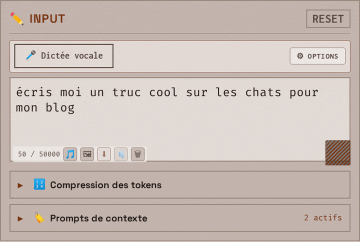
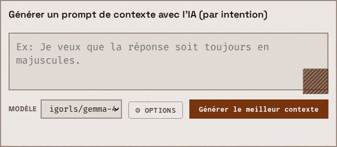
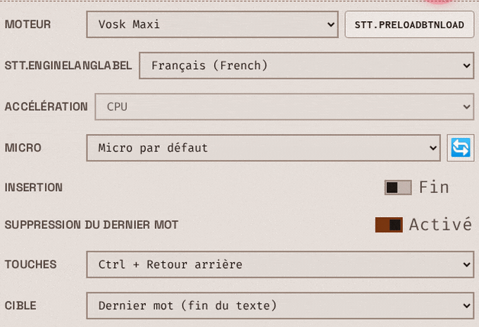
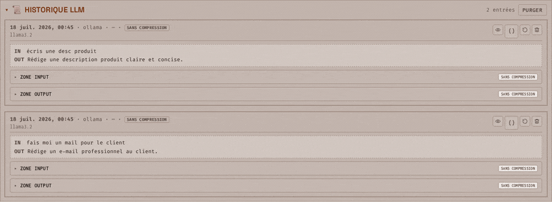
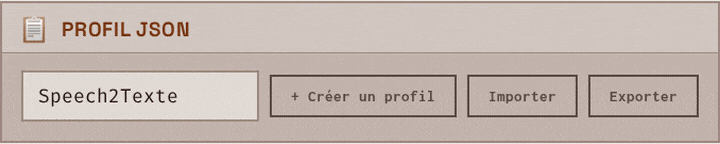
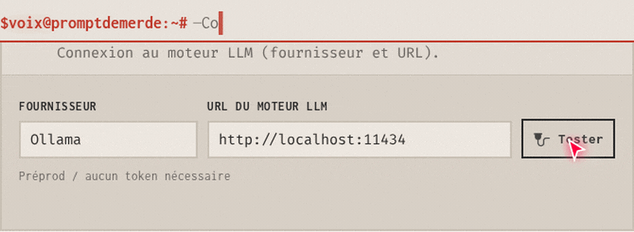

#  PromptDeMerde

<p align="center">
  
</p>

<p align="center">
  <a href="LICENSE"></a>
  <a href="https://github.com/JeanSebastienBash/promptdemerde/tags"></a>
  <a href="https://github.com/JeanSebastienBash/promptdemerde/actions/workflows/ci.yml"></a>
</p>

<p align="center">
  <strong>On <a href="https://promptdemerde.com/">promptdemerde.com</a> and in this repository: the same codebase, the same 100% privacy model — no account, no product telemetry. Current line is a release candidate, still being stabilized.</strong>
</p>

<p align="justify">
PromptDeMerde turns freeform input into structured prompts in the browser: local Ollama Clean, voice dictation (STT), media transcription, vision image-to-text, system + context prompt stacking, multipass Input, LLM history, and portable JSON profile ZIP export for offline collaboration. Fully private — no account, no product telemetry, data stays in the browser. Official site promptdemerde.com or self-host PHP — same codebase.
</p>

<p align="center">
  <strong>Install <a href="https://ollama.com">Ollama</a> locally — without it, Clean/LLM is off (voice dictation, audio/video transcription, and profile ZIP still work).</strong>
</p>

<p align="center">
  <a href="https://dreamproject.online/prj/promptdemerde/">DreamprojectAI</a> ·
  <a href="./docs/Documentation.md">Advanced documentation</a> ·
  <a href="SECURITY.md">Security</a> ·
  <a href="CONTRIBUTING.md">Contributing</a>
</p>

---

<a id="menu-videos"></a>

## Videos

<table>
<tr>
<td width="28%" valign="top">

More videos will follow on the PromptDeMerde YouTube playlist. The Short on the right is a scripted marketing clip (internal tooling, not published) — music and framing, not a product tutorial.

</td>
<td width="44%" valign="top" align="center">


<strong>Workspace — raw prompt in Input (comics classifieds), contexts, empty Output, LLM history</strong><br>
<em>Theme Plum light (`prune-day`). Input holds a spoken-style comics listing (Lyon, bus-stop meetup). Context prompts open (personal info / meetup / firm price). Output empty with Thinking on and model <code>deepseek-r1:671b</code>. History shows two other daily LLM uses (workshop notes, supplier RFQ).</em>

</td>
<td width="28%" valign="top" align="center">

<a href="https://www.youtube.com/shorts/SR2TaUZ7bTw">

</a>

<br>
<a href="https://www.youtube.com/shorts/SR2TaUZ7bTw">Watch the Short on YouTube</a>

</td>
</tr>
</table>

---

<a id="menu-whats-new"></a>

## 🆕 What’s new

### Version 1.23.0 (RC)

*Release candidate — not yet stable.*

* **Image import → description** in the Workspace: file picker only (PNG, JPEG, WebP, GIF) → local Ollama vision model (default `moondream`) → text in Input.
* Vision model and instruction editable under **Prompts** (`pdm_image_model`, `pdm_image_prompt`).
* Profile contract: **51** `pdm_*` keys; shipped `speech2texte` profile aligned to v1.23.0.
* Public GitHub: **git tags only** — no GitHub Releases; no declared stable line yet.

[Advanced docs — image import](docs/Documentation.md#6bis-import-image--description) · [Tag notes](.github/RELEASE_v1.23.0.md)

### Version 1.22.x

* Audio **or video** import for local transcription; dictation available again after Whisper without Reset.
* Token **compression**: optional checkboxes applied on **Clean** (no separate Compress button).
* History cards show Original / Compressed traces for Input, the system prompt, context prompts, and Output.
* Context prompt generators by **intention**: model picker, stream, Stop.
* On a clone without a local catalogue, **Marketplace** opens [promptdemerde.com/#market](https://promptdemerde.com/#market).
* Product toasts / status: impersonal register (twelve locales).

[Tag notes v1.22.0](.github/RELEASE_v1.22.0.md)

---

## Table of contents

**Numbering (LLM pilot):** product sections **1–12**. Under **§5 Features**, theme groups are **5.1–5.7**; each capability is **5.x.y** (seven groups, dozens of capabilities). Every TOC glyph below is unique. Videos and What’s new sit **above** this list and are **not** numbered product sections.

* ✨ [1. What PromptDeMerde is](#menu-what-is) — raw prompt in, structured prompt out; Ollama local; session in the browser
* 👤 [2. Who it is for](#menu-who) — solo · power user · small team · one shared language (JSON profile) for humans and LLMs
* 🌐 [3. Official site = self-hosted copy](#menu-official-site) — official site or private install · same SPA, ZIP, and client-side data
* 🔒 [4. Zero telemetry](#menu-zero-telemetry) — no product telemetry; no server DB of Workspace content · identical privacy on the official site and on a clone
* 🧩 [5. Features](#menu-features) — dozens of delivered capabilities (screenshots under `assets/images/screenshots/`)
  * ✦ [5.1. Clean & Workspace](#feat-5-1)
    * 🪄 [5.1.1. Clean / rephrase with Ollama](#feat-5-1-1) — local model + system prompt + enabled `#Tag` → Output
    * ↔️ [5.1.2. Workspace Input → Output](#feat-5-1-2) — the workbench: prompt cleaning · voice dictation · audio transcription · image to text recognition
    * 🎛 [5.1.3. Workspace LLM options](#feat-5-1-3) — model choice · temperature control · token limit · custom timeout · thinking toggle
    * 📄 [5.1.4. Output display formats](#feat-5-1-4) — plain text · JSON · HTML
    * 🔢 [5.1.5. Input character counter, Reset and trash](#feat-5-1-5) — 50k characters on Input · Reset (confirm) clears Input+Output · trash clears Input
    * 💾 [5.1.6. Workspace autosave and prompt guard](#feat-5-1-6) — Workspace session state; Clean blocked until a prompt is active
    * ⛔ [5.1.7. Mutual exclusion of Input modes](#feat-5-1-7) — dictate · media · image · Clean never overlap blindly
    * ⏱ [5.1.8. Thinking, Stop and stream metadata](#feat-5-1-8) — cancel mid-run; time · tokens · throughput · multipass index
  * ✧ [5.2. System prompt, `#Tag` contexts & generators](#feat-5-2)
    * #️⃣ [5.2.1. System prompt and context prompts (#Tag)](#feat-5-2-1) — stackable blocks; inject before or after system
    * 🧠 [5.2.2. AI-assisted context prompt generators](#feat-5-2-2) — intention or title → new `#Tag` via Ollama
    * 🗂 [5.2.3. Workspace context-prompt panel](#feat-5-2-3) — pick which `#Tag` contexts join Clean · active count · edit on Prompts
    * ↕ [5.2.4. Prompts screen: order, drag-and-drop and counter](#feat-5-2-4) — reorder `#Tag` · inject before/after system · tag count
  * ✶ [5.3. Voice, media & vision into Input](#feat-5-3)
    * 🎤 [5.3.1. Unlimited voice dictation with Vosk, Parakeet or Whisper](#feat-5-3-1) — in-browser STT · local recognition · no cloud audio
    * 🎬 [5.3.2. Import audio or video (audio transcription)](#feat-5-3-2) — Whisper Maxi path; voice dictation still available after
    * ⬇ [5.3.3. Export one session audio file](#feat-5-3-3) — merge dictation takes → one download
    * 🖼 [5.3.4. Describe an image (Ollama vision)](#feat-5-3-4) — file picker → vision model → text in Input
    * ⚙ [5.3.5. Advanced dictation options](#feat-5-3-5) — preload, language, CPU/GPU, mic, caret insert, delete-word · while voice dictation
    * ↻ [5.3.6. Dictation outside Workspace and resume after interrupt](#feat-5-3-6) — keep talking in Options/docs; confirm before wipe/reload
  * ✷ [5.4. History, compression & long Input](#feat-5-4)
    * 📜 [5.4.1. Local history with traces](#feat-5-4-1) — Input / system / `#Tag` / Output cards; Original · Compressed pairs
    * 🗜 [5.4.2. Optional token compression](#feat-5-4-2) — checkboxes applied on Clean (no separate Compress button)
    * ∞ [5.4.3. Long Input, multi-pass](#feat-5-4-3) — split → successive Ollama passes → concatenate
    * ⏸ [5.4.4. Compression panel, overlay and Stop](#feat-5-4-4) — lock Output while compressing; Stop; session chips
    * 📤 [5.4.5. History](#feat-5-4-5) — restore, modal and JSON export; ~100 entries; per-block copy; optional source audio
  * ✸ [5.5. JSON profile ZIP & Marketplace](#feat-5-5)
    * 📦 [5.5.1. Import / export JSON profile (ZIP)](#feat-5-5-1) — `.zip` only; integrity check; proxy tokens excluded
    * 🎨 [5.5.2. UI personalization](#feat-5-5-2) — logo colours, titles, labels, theme, synopsis via profile keys
    * 🏪 [5.5.3. Marketplace of JSON profiles](#feat-5-5-3) — ready-made packs on the official site (clone falls back to `#market`)
    * 🔀 [5.5.4. Profiles: create, switch, export modal](#feat-5-5-4) — minimal / maximal preset; startup language
    * 🔎 [5.5.5. Marketplace: search, filters and detail card](#feat-5-5-5) — when a local catalogue is present
  * ✹ [5.6. Languages, themes & same code everywhere](#feat-5-6)
    * 🗣 [5.6.1. Twelve UI languages & about 50 themes](#feat-5-6-1) — default Marron clair (`marron-day`)
    * ≡ [5.6.2. Same code everywhere](#feat-5-6-2) — promptdemerde.com ≡ this repo’s SPA
    * 🌓 [5.6.3. Day / night theme toggle](#feat-5-6-3) — light ↔ dark of the active family
    * ♿ [5.6.4. Reduced motion and RTL](#feat-5-6-4) — `prefers-reduced-motion`; Arabic `dir=rtl`
  * ✺ [5.7. Shell, navigation, Options & footer](#feat-5-7)
    * 🧭 [5.7.1. Hash-based SPA navigation](#feat-5-7-1) — Workspace · Prompts · Options · Market without full reload
    * ☰ [5.7.2. Burger menu, Escape and loader](#feat-5-7-2) — mobile nav; Escape closes; startup loader
    * 🏷 [5.7.3. Environment badge and GitHub version](#feat-5-7-3) — PROD / PRE-PROD / SELF-HOSTED via web server configuration; version links to GitHub tags
    * ⌨ [5.7.4. Clean shortcut and on-screen feedback](#feat-5-7-4) — Ctrl/Cmd+Enter runs Clean; brief toast notices; “Copied” after copy
    * 💫 [5.7.5. Logo, shell animation and profile synopsis](#feat-5-7-5) — brand driven by the active JSON profile
    * 🔌 [5.7.6. LLM Options: Test and proxy token](#feat-5-7-6) — Ollama URL test; model list; session proxy token for operator prod relay
    * ⚠ [5.7.7. Danger zone Wipe all](#feat-5-7-7) — localStorage · sessionStorage · audio IDB · STT caches → fresh install
    * 📎 [5.7.8. Footer: project carousel and resources](#feat-5-7-8) — DreamProjectAI carousel · stack badges · docs / support
* 🧳 [6. JSON profile](#menu-json-profile) — export prompts, LLM settings, UI labels · logo · language, theme and history in one portable archive
* 📋 [7. Prerequisites](#menu-prerequisites) — what to install before the first Clean
  * 🌍 [7.1. Official site](#prereq-7-1) — browser + local Ollama (+ `OLLAMA_ORIGINS`)
  * 🛠 [7.2. Self-host](#prereq-7-2) — PHP stack + `install/restore-large-assets.sh` + Ollama
* ▶ [8. Try it in three steps](#menu-try-it) — pull an Ollama model · open your self-hosted app or go to the official site (same privacy) to Clean a raw prompt
* 🖥 [9. Self-hosting (optional)](#menu-self-hosting) — clone from GitHub · reassemble dictation models from local parts · run with PHP · open your local URL
* © [10. Credits](#menu-credits) — Ollama, STT engines, fonts, and related stacks
* 📚 [11. Further reading](#menu-further-reading) — advanced docs, security, contributing, tag notes
* ⚖ [12. License](#menu-license) — MIT
---

<a id="menu-what-is"></a>

## ✨ 1. What PromptDeMerde is

PromptDeMerde reformulates a **raw prompt** (typed, dictated via voice dictation, transcribed from audio/video, or described from an image) into a **cleaned prompt** using:

* an optional **system prompt**;
* optional **context prompts (`#Tag`)** enabled in the Workspace;
* a model served by **Ollama** on the user’s machine.

Session data (raw prompt / Workspace state, history, settings, profiles) is stored in the **browser** (`localStorage`; IndexedDB for voice-dictation audio). No signup required. User session state stays outside any server-side application database.

[Advanced documentation — presentation](docs/Documentation.md#1-présentation) · [Privacy model](docs/Documentation.md#2-modèle-de-confidentialité)

---

<a id="menu-who"></a>

## 👤 2. Who it is for

* **Solo / freelancer** — one JSON profile reused for recurring prompt work (mail, posts, briefs, image prompts, etc.).
* **Power user** — local Ollama, editable system prompt and context prompts, in-browser STT, vision model, compression, multipass Input.
* **Small team** — same JSON profile ZIP shared so everyone uses the same cleaning rules (shared file configuration).
* **Anyone using the official site or a private install** — same application code and the same client-side data model (see privacy below).

---

<a id="menu-official-site"></a>

## 🌐 3. Official site = self-hosted copy

[promptdemerde.com](https://promptdemerde.com/) and a clone from this repository run the **same application** (same SPA, Workspace, profile ZIP format).

While the official site is online, DreamProjectAI allows using it under the same conditions as a private install for application behaviour. Self-hosting: clone, reassemble dictation models from local parts (`install/restore-large-assets.sh`), run with Apache or Nginx + PHP, open your local URL.

In both cases, Workspace content and profiles stay in the browser.

---

<a id="menu-zero-telemetry"></a>

## 🔒 4. Zero telemetry

> Prompts, history, imported media, transcriptions, and profile data are processed and stored in the **browser**. The application collects **no product telemetry**. There is **no** application database of user content on the official server.

Web-server access logs may record **IP address** and **page URL** (standard HTTP logging). Those logs do not contain Workspace text, uploaded files, or transcription results.

Same client-side model on the official site and on a self-hosted copy.  
[`SECURITY.md`](SECURITY.md) · [Advanced docs — privacy](docs/Documentation.md#2-modèle-de-confidentialité)

---

<a id="menu-features"></a>

## 🧩 5. Features

Theme groups **5.1–5.7**; capabilities **5.x.y** (dozens in total). Each subsection describes a delivered capability and links to the matching section in the advanced documentation. Screenshots: `assets/images/screenshots/`.

---

<a id="feat-5-1"></a>

### ✦ 5.1. Clean & Workspace

---

<a id="feat-5-1-1"></a>

### 🪄 5.1.1. Clean / rephrase with Ollama

**Clean** sends Input to a local Ollama model with the active system prompt and the enabled context prompts (`#Tag`). Output is the rephrased prompt, ready to copy.

The model is the one configured in the app (pulled with `ollama pull`). Connection errors surface in the UI with a path back to Options → LLM.

[Advanced docs — Workspace](docs/Documentation.md#32-workspace) · [Ollama flows](docs/Documentation.md#4-ollama--flux-a-et-flux-b)

---

<a id="feat-5-1-2"></a>

### ↔️ 5.1.2. Workspace Input → Output

Workspace layout:

* **Input** — raw prompt (type, voice dictation, import media, image description)
* **Output** — cleaned prompt
* Actions — Clean, copy, Reset (confirmation required)

<p align="center">
  
  <br>
  <strong>Workspace — Input panel</strong><br>
  <em>Raw prompt text is visible in Input, with the voice dictation (Dictée vocale) strip and Reset at the top. Below, Prompts de contexte shows 2 actifs.</em>
</p>

[Advanced docs — Workspace](docs/Documentation.md#32-workspace)

---

<a id="feat-5-1-3"></a>

### 🎛 5.1.3. Workspace LLM options

On the Output strip: **model choice** (dropdown of local Ollama models). Open **⚙ Options** for the rest of the run knobs:

* **Temperature control** — slider (creativity / determinism)
* **Token limit** — max output tokens
* **Custom timeout** — inference deadline (0 = unlimited)
* **Thinking toggle** — ON/OFF for model thinking when the model supports it (optional max thinking characters)

URL and connection test: Options → LLM. Public path: leave **“I don’t have a token”** checked and use local Ollama. Display format radios in the same panel are covered in **5.1.4**.

[Advanced docs — LLM parameters](docs/Documentation.md#43-paramètres-llm-workspace-panel)

---

<a id="feat-5-1-4"></a>

### 📄 5.1.4. Output display formats

Output can be shown as plain text, JSON, or HTML.

[Advanced docs — OUTPUT display format](docs/Documentation.md#322-format-daffichage-output)

---

<a id="feat-5-1-5"></a>

### 🔢 5.1.5. Input character counter, Reset and trash

**Character counter** beside Input: live `count / 50000`. The Input textarea is capped at **50,000** characters (`maxlength`); the same ceiling applies when exporting `pdm_workspace.input` in a ZIP. Inference itself has **no** hard length cap — long Input uses multipass (see **5.4.3**).

Two different clear actions (not one “Input only or both panes” choice):

* **Reset** (header on Input and on Output — same control): confirmation required; clears **Input and Output**.
* **Trash** (under Input): clears Input without confirmation; when Input is empty, Output is cleared too (Workspace sync). Blocked during dictation. Reset is also blocked during dictation or an active Clean.

[Advanced docs — Workspace](docs/Documentation.md#32-workspace) · [Long Input / 50k export note](docs/Documentation.md#321-input-long-multi-pass-inférence)

---

<a id="feat-5-1-6"></a>

### 💾 5.1.6. Workspace autosave and prompt guard

The Workspace session state (Input raw prompt, Output, thinking, context-panel state) autosaves in the browser. **Clean** stays disabled until a system prompt or at least one context prompt is active; a guard message explains what to enable.

---

<a id="feat-5-1-7"></a>

### ⛔ 5.1.7. Mutual exclusion of Input modes

Dictation, audio/video import, image import and inference lock each other out. Inline status and toasts state the cause and the next action when modes conflict.

---

<a id="feat-5-1-8"></a>

### ⏱ 5.1.8. Thinking, Stop and stream metadata

When the model supports it, thinking can be enabled with a character cap (0 = unlimited). A dedicated panel shows and copies thinking text. **Stop** cancels inference or compression. During the stream, the UI shows time, tokens, throughput and multi-pass index.

---

<a id="feat-5-2"></a>

### ✧ 5.2. System prompt, `#Tag` contexts & generators

---

<a id="feat-5-2-1"></a>

### #️⃣ 5.2.1. System prompt and context prompts (#Tag)

The **system prompt** sets the cleaning personality. It can be enabled or disabled. When empty, the built-in default is used.

**Context prompts (`#Tag`)** are stackable blocks. Enable or disable them for each Clean. Injection order — **before** or **after** the system prompt — is configurable.

[Advanced docs — prompts, system, context prompts](docs/Documentation.md#5-prompts--système-prompts-de-contexte-générateurs)

---

<a id="feat-5-2-2"></a>

### 🧠 5.2.2. AI-assisted context prompt generators

On the **Prompts** screen, the context prompt generators create a new `#Tag` from an **intention** or a **title** via the local Ollama model. Streaming, Stop, model selection and basic options are available on that screen.

[Advanced docs — assisted `#Tag` generation](docs/Documentation.md#52-génération-assistée-de-tag)

<p align="center">
  
  <br>
  <strong>AI context prompt generator (#Tag) by intention</strong><br>
  <em>On Prompts, describe an intention, pick a local Ollama model, then generate a new context prompt (#Tag).</em>
</p>

---

<a id="feat-5-2-3"></a>

### 🗂 5.2.3. Workspace context-prompt panel

Under Input, the **Context prompts** panel is the `#Tag` picker for Clean: enable or disable which context blocks ride with the system prompt. Starts collapsed (open/closed state remembered). An **active count** badge shows how many tags are on. Toolbar: **All** / **None** for bulk toggle; **Manage →** opens the Prompts screen to create or edit tags.

[Advanced docs — Workspace / active tags](docs/Documentation.md#32-workspace) · [Context prompts `#Tag`](docs/Documentation.md#5-prompts--système-prompts-de-contexte-générateurs)

---

<a id="feat-5-2-4"></a>

### ↕ 5.2.4. Prompts screen: order, drag-and-drop and counter

On the Prompts screen, the system prompt toggles with autosave. **Injection order** (`pdm_context_position`) chooses whether active `#Tag` contexts are sent **before** or **after** the system prompt — the UI shows that stack as a small diagram (`#context-inject-diagram`). The tag list reorders by drag-and-drop or arrows (display order = injection order among contexts). A counter shows how many context prompts exist.

---

<a id="feat-5-3"></a>

### ✶ 5.3. Voice, media & vision into Input

---

<a id="feat-5-3-1"></a>

### 🎤 5.3.1. Unlimited voice dictation with Vosk, Parakeet or Whisper

The Workspace dictation strip supports unlimited voice dictation. Available engines are **Vosk**, **Parakeet** and **Whisper**, depending on which one is loaded. Recognition runs **in the browser**: audio is not sent to a remote STT server.

Language coverage is delivered as-is: **Vosk Mini** for the shipped languages, **Vosk Maxi** for French. No major language expansion or Vosk engine redesign is planned on the path to product maturity; only minor fixes.

Dictation continues when you open Options or documentation. Stopping uses an explicit control.

<p align="center">
  
  <br>
  <strong>STT engine options — Vosk Maxi</strong><br>
  <em>Dictation engine panel with Vosk Maxi, French, default mic, insert at end, and delete-last-word shortcut.</em>
</p>

[Advanced docs — dictation and audio](docs/Documentation.md#6-dictée-vocale-et-audio)

---

<a id="feat-5-3-2"></a>

### 🎬 5.3.2. Import audio or video (audio transcription)

The 🎵 import accepts audio files and, when the browser can decode them, video containers. Audio transcription uses the local Whisper Maxi path; the resulting text is written into Input. Afterwards, dictation remains available without a full Reset.

Media is processed on the machine that opened the page.

[Advanced docs — dictation and audio](docs/Documentation.md#6-dictée-vocale-et-audio)

---

<a id="feat-5-3-3"></a>

### ⬇ 5.3.3. Export one session audio file

Download a single audio file that merges the dictation takes of the current session. Merge and download run in the browser.

[Advanced docs — WebM recording](docs/Documentation.md#64-enregistrement-webm)

---

<a id="feat-5-3-4"></a>

### 🖼 5.3.4. Describe an image (Ollama vision)

Workspace file picker → vision-capable Ollama model → description text in Input. Model and instruction are set under Prompts. Missing model: toast with `ollama pull <model>` and a pointer to Prompts → image.

[Advanced docs — image → description](docs/Documentation.md#6bis-import-image--description)

---

<a id="feat-5-3-5"></a>

### ⚙ 5.3.5. Advanced dictation options

The dictation strip includes an options panel: engine preload, Vosk language, CPU or GPU acceleration, microphone choice, insert at end or at caret, and a delete-word shortcut. A progress bar tracks model load. Hints cover HTTPS / LAN constraints.

---

<a id="feat-5-3-6"></a>

### ↻ 5.3.6. Dictation outside Workspace and resume after interrupt

Dictation can continue while opening Options or documentation. Before a disruptive reload (language change, wipe, profile import), a modal asks for confirmation; a beep and a resume offer are available after reload.

---

<a id="feat-5-4"></a>

### ✷ 5.4. History, compression & long Input

---

<a id="feat-5-4-1"></a>

### 📜 5.4.1. Local history with traces

Capped local history of Clean runs. Cards expose Input, the system prompt, context prompts, and Output; with compression enabled, Original and Compressed pairs. Copy, restore, purge. Included in a full profile export when that preset is selected.

<p align="center">
  
  <br>
  <strong>Local history with Input and Output traces</strong><br>
  <em>Historique LLM open: stacked cards with IN/OUT previews, timestamps, model (ollama · llama3.2), and zone blocks for prior Clean runs.</em>
</p>

[Advanced docs — Workspace](docs/Documentation.md#32-workspace)

---

<a id="feat-5-4-2"></a>

### 🗜 5.4.2. Optional token compression

Checkboxes cover the system prompt, context prompts, Input, and Output. Applied when **Clean** runs. Default: all off.

[Advanced docs — compress tokens](docs/Documentation.md#323-compresser-les-tokens)

---

<a id="feat-5-4-3"></a>

### ∞ 5.4.3. Long Input, multi-pass

Long Input is split into successive Ollama passes; results are concatenated. Limits and behaviour: advanced docs.

[Advanced docs — long INPUT multipass](docs/Documentation.md#321-input-long-multi-pass-inférence)

---

<a id="feat-5-4-4"></a>

### ⏸ 5.4.4. Compression panel, overlay and Stop

Token compression is configured in a collapsible panel. While Output compression runs, an overlay locks the area and offers **Stop**. Chips mark targets already compressed in the session.

---

<a id="feat-5-4-5"></a>

### 📤 5.4.5. History: restore, modal and JSON export

Local history (about 100 entries) can restore Input, Output and thinking. Entries open in a modal, support per-block copy, JSON export and optional source audio from IndexedDB. Global purge and single-entry delete ask for confirmation.

---

<a id="feat-5-5"></a>

### ✸ 5.5. JSON profile ZIP & Marketplace

---

<a id="feat-5-5-1"></a>

### 📦 5.5.1. Import / export JSON profile (ZIP)

Portable unit: **ZIP** archive with the JSON profile (and related assets when included). Import accepts **`.zip` only**. Client-side processing; integrity check on import. Proxy tokens are excluded from the portable profile.

<p align="center">
  
  <br>
  <strong>JSON profile — create, import, export</strong><br>
  <em>Options → JSON profile: switch profiles, import a ZIP, or export the portable archive.</em>
</p>

[Advanced docs — ZIP export / import](docs/Documentation.md#7-export--import--archive-zip-profil)

---

<a id="feat-5-5-2"></a>

### 🎨 5.5.2. UI personalization

Profile can include logo colours, screen titles, button labels, theme, header animation / synopsis. Documented under ZIP customization keys.

[Advanced docs — UI keys and brand](docs/Documentation.md#75-personnalisation-par-édition-zip)

---

<a id="feat-5-5-3"></a>

### 🏪 5.5.3. Marketplace of JSON profiles

A marketplace of ready-to-import JSON profiles is available on the [official site](https://promptdemerde.com/#market) (soon).

On a public clone without a local catalogue, the Marketplace menu opens that URL.

---

<a id="feat-5-5-4"></a>

### 🔀 5.5.4. Profiles: create, switch, export modal

Options → JSON profile can create a profile, switch (with confirm and reload), import a ZIP and export through a modal (file name, minimal or maximal preset, startup language, i18n flags).

---

<a id="feat-5-5-5"></a>

### 🔎 5.5.5. Marketplace: search, filters and detail card

When a local catalogue is present, Marketplace provides search, filters (price, domains, languages, publishers), sort, grid or list views and a detail modal with download. On a clone without a catalogue, the menu opens the official site.

---

<a id="feat-5-6"></a>

### ✹ 5.6. Languages, themes & same code everywhere

---

<a id="feat-5-6-1"></a>

### 🗣 5.6.1. Twelve UI languages & about 50 themes

Twelve UI locales. Themes: light/dark families. First-visit default: **Marron clair** (`marron-day`). Language and theme can be included in a profile export.

[Advanced docs — i18n](docs/Documentation.md#35-i18n)

---

<a id="feat-5-6-2"></a>

### ≡ 5.6.2. Same code everywhere

Official site and self-hosted install share the application codebase. Operator proxy token: official production relay only. Visitors using local Ollama keep **“I don’t have a token”** checked.

[Advanced docs — installation](docs/Documentation.md#10-installation-auto-hébergée) · [`SECURITY.md`](SECURITY.md)

---

<a id="feat-5-6-3"></a>

### 🌓 5.6.3. Day / night theme toggle

A navigation control switches quickly between light and dark variants of the active theme family.

---

<a id="feat-5-6-4"></a>

### ♿ 5.6.4. Reduced motion and RTL

The app respects `prefers-reduced-motion` to limit animations. Right-to-left locales (for example Arabic) set `lang` and `dir` on the document.

---

<a id="feat-5-7"></a>

### ✺ 5.7. Shell, navigation, Options & footer

---

<a id="feat-5-7-1"></a>

### 🧭 5.7.1. Hash-based SPA navigation

The UI switches between Workspace, Prompts, Options and Marketplace via the URL hash, without a full page reload. On a clone without `site-pages/`, footer Mentions / Terms / Privacy / Support open [promptdemerde.com](https://promptdemerde.com) (green badge, same pattern as Marketplace). The Documentation link opens the GitHub technical docs ([`docs/Documentation.md`](docs/Documentation.md)).

---

<a id="feat-5-7-2"></a>

### ☰ 5.7.2. Burger menu, Escape and loader

On small viewports, the burger menu opens and closes navigation. Escape closes the menu. A full-screen loader shows during startup initialisation.

---

<a id="feat-5-7-3"></a>

### 🏷 5.7.3. Environment badge and GitHub version

The footer shows an environment badge (PROD, PRE-PROD or SELF-HOSTED) from `PDM_ENV` (web server configuration). The version label links to the project’s GitHub tags.

---

<a id="feat-5-7-4"></a>

### ⌨ 5.7.4. Clean shortcut and on-screen feedback

**Ctrl+Enter** (or **Cmd+Enter** on macOS) runs **Clean**. Status toasts (success, error, info) stay on screen about 4.5 seconds. Copy actions show a short “Copied” confirmation.

---

<a id="feat-5-7-5"></a>

### 💫 5.7.5. Logo, shell animation and profile synopsis

The navigation logo, header shell animation and typewriter synopsis can be driven by the profile (brand, colours, text).

---

<a id="feat-5-7-6"></a>

### 🔌 5.7.6. LLM Options: Test and proxy token

Under Options → LLM, **Test** checks the Ollama URL and refreshes the model list. An optional proxy token (operator production relay only) stays in browser session storage — visitors and self-hosters keep **“I don’t have a token”** checked.

---

<a id="feat-5-7-7"></a>

### ⚠ 5.7.7. Danger zone Wipe all

**Wipe all** asks for confirmation, then clears localStorage, sessionStorage, audio IndexedDB and STT caches, and reloads into a fresh-install state.

---

<a id="feat-5-7-8"></a>

### 📎 5.7.8. Footer: project carousel and resources

The footer includes a DreamProjectAI project carousel, stack badges (LLM, Ollama, STT, JSON, OSS, and related labels) and links to documentation, support and external resources.


<a id="menu-json-profile"></a>

## 🧳 6. JSON profile

<p align="center">
  
  <br>
  <strong>JSON profile — create, import, export</strong><br>
  <em>Options → JSON profile: switch profiles, import a ZIP, or export the portable archive.</em>
</p>

The JSON profile (exported as ZIP) can hold the system prompt, context prompts (`#Tag`), LLM settings, theme, language, Workspace session state, history, and UI labels.

**Before clearing site data or changing machine:** export the profile (*Options → JSON profile → Export*). Import: *Options → JSON profile → Import* (`.zip` only).

[Advanced docs — ZIP](docs/Documentation.md#7-export--import--archive-zip-profil)

---

<a id="menu-prerequisites"></a>

## 📋 7. Prerequisites

<p align="center">
  
  <br>
  <strong>Options → LLM — test the Ollama connection</strong><br>
  <em>Before using Clean/rephrase, set the LLM engine under Options → LLM (Ollama + URL) and use Test to verify the local connection.</em>
</p>

<a id="prereq-7-1"></a>

### 7.1. Official site

* Desktop browser (Chromium or Firefox recommended for STT / WebAudio)
* [Ollama](https://ollama.com/download) on the **same computer** as the browser
* At least one chat model (example: `ollama pull llama3.2`)
* For image description: a vision model (default in app: `moondream`)
* Microphone permission for dictation
* Network to load the site; usual visitor setup talks to Ollama on `localhost`

For **https://promptdemerde.com**:

```bash
OLLAMA_ORIGINS=https://promptdemerde.com ollama serve
```

[Advanced docs — Ollama](docs/Documentation.md#4-ollama--flux-a-et-flux-b)

<a id="prereq-7-2"></a>

### 7.2. Self-host

* PHP-capable host (Apache or Nginx + PHP)
* Git
* Disk for STT model parts; after clone:

```bash
cd install
bash restore-large-assets.sh
```

* Ollama reachable from the browser
* Optional: `PDM_ENV` (footer badge); proxy token for official relay operators only — [`SECURITY.md`](SECURITY.md)

Clean quality depends on the chosen Ollama model. STT uses ONNX / WASM in the browser; a dedicated GPU is optional.

[Advanced docs — self-hosted install](docs/Documentation.md#10-installation-auto-hébergée)

---

<a id="menu-try-it"></a>

## ▶ 8. Try it in three steps

| Step | Action |
|------|--------|
| **1** | Install [Ollama](https://ollama.com/download) on the same PC as the browser; pull a model |
| **2** | Open [promptdemerde.com](https://promptdemerde.com/) — keep **“I don’t have a token”** checked (*Options → LLM*) |
| **3** | Import a JSON profile (*Options → JSON profile*) or configure *Prompts* — then write or dictate → **Clean** → copy |

<p align="center">
  <a href="https://promptdemerde.com/"><strong>Open PromptDeMerde →</strong></a>
</p>

---

<a id="menu-self-hosting"></a>

## 🖥 9. Self-hosting (optional)

```bash
git clone https://github.com/JeanSebastienBash/promptdemerde.git
cd promptdemerde/install
bash restore-large-assets.sh
```

After clone, `restore-large-assets.sh` **reassembles** the large dictation model files from the `*.partNNN` pieces already in the repository (no download). Run the site with Apache or Nginx + PHP, install Ollama, then open your local URL in the browser.

<details>
<summary><strong>Operators — token proxy and PDM_ENV</strong></summary>

<br>

Visitors and self-hosters: keep **“I don’t have a token”** checked. Proxy token: official production operator relay only. Optional `PDM_ENV`: footer badge PROD / PRE-PROD / SELF-HOSTED.

[`SECURITY.md`](SECURITY.md) · [Deployment notes](docs/Documentation.md#deploy-pdm-env-badges)

</details>

---

<a id="menu-credits"></a>

## © 10. Credits

Published by **[DreamProjectAI](https://dreamproject.online)**.

Third-party components (full list: [`THIRD_PARTY_NOTICES.md`](THIRD_PARTY_NOTICES.md)):

* **[Ollama](https://ollama.com)** — local LLM runtime for Clean and vision (not redistributed in this repo)
* **JSZip** — profile ZIP in the browser
* **ONNX Runtime Web**, **Transformers.js**, **Vosk**, **Parakeet** — in-browser speech pipelines
* **Fonts** shipped locally (Fira Code, Inconsolata, Space Grotesk, Archivo Black, Anton) — OFL

Security reports: see [`SECURITY.md`](SECURITY.md).

---

<a id="menu-further-reading"></a>

## 📚 11. Further reading

| Topic | Document |
|-------|----------|
| Screens, keys, ZIP, STT, architecture | [**Advanced user documentation**](docs/Documentation.md) |
| Contribute | [`CONTRIBUTING.md`](CONTRIBUTING.md) |
| Security and deployment | [`SECURITY.md`](SECURITY.md) |
| Third-party notices | [`THIRD_PARTY_NOTICES.md`](THIRD_PARTY_NOTICES.md) |
| STT models (zone) | [`docs/Stt.md`](docs/Stt.md) |
| Vosk catalogue | [`docs/Stt-vosk.md`](docs/Stt-vosk.md) |
| Profiles (zone) | [`docs/Profiles.md`](docs/Profiles.md) |
| Vendor JS (zone) | [`docs/Vendor.md`](docs/Vendor.md) |

---

<a id="menu-license"></a>

## ⚖ 12. License

MIT — [DreamProjectAI](https://dreamproject.online)
