#  PromptDeMerde

<p align="center">
  
</p>

<p align="center">
  <a href="LICENSE"></a>
  <a href="https://github.com/JeanSebastienBash/promptdemerde/tags" target="_blank" rel="noopener noreferrer"></a>
  <a href="https://github.com/JeanSebastienBash/promptdemerde/actions/workflows/ci.yml" target="_blank" rel="noopener noreferrer"></a>
</p>

<p align="center">
  <strong>On <a href="https://promptdemerde.com/" target="_blank" rel="noopener noreferrer">promptdemerde.com</a> and in this repository: the same codebase, the same 100% privacy model — no account, no product telemetry. Current line is a release candidate, still being stabilized.</strong>
</p>

<p align="justify">
PromptDeMerde turns freeform input into structured prompts in the browser: local Ollama reformulation, voice dictation (STT), media transcription, vision image-to-text, system + context prompt stacking, multipass Input, LLM history, and portable JSON profile ZIP export for offline collaboration. Fully private — no account, no product telemetry, data stays in the browser. Official site promptdemerde.com or self-host PHP — same codebase.
</p>

<p align="center">
  <strong>Install <a href="https://ollama.com" target="_blank" rel="noopener noreferrer">Ollama</a> locally — without it, reformulation/LLM is off (voice dictation, audio/video transcription, and profile ZIP still work).</strong>
</p>

<p align="center">
  <a href="https://dreamproject.online/prj/promptdemerde/" target="_blank" rel="noopener noreferrer">DreamprojectAI</a> ·
  <a href="./docs/Documentation.md">Technical documentation</a> ·
  <a href="SECURITY.md">Security</a> ·
  <a href="CONTRIBUTING.md">Contributing</a>
</p>

---

<a id="menu-videos"></a>

## Videos

<table>
<tr>
<td width="28%" valign="top">

More videos will follow on the <a href="https://www.youtube.com/@DreamprojectAI/playlists" target="_blank" rel="noopener noreferrer">DreamProjectAI YouTube playlists</a>. The Short on the right is a marketing insert only — music and framing, not a product tutorial.

</td>
<td width="44%" valign="top" align="center">

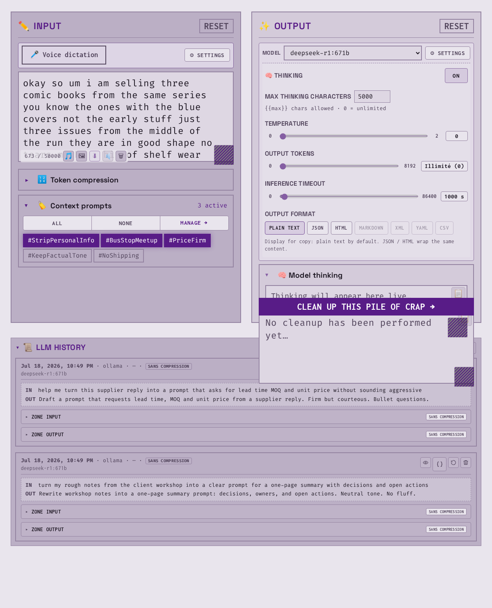

<strong>Workspace — raw prompt in Input (comics classifieds), contexts, empty Output, LLM history</strong><br>
<em>Theme Plum light (<code>prune-day</code>). Input holds a spoken-style comics listing (Lyon, bus-stop meetup). Context prompts open (personal info / meetup / firm price). Output empty with Thinking on and model <code>deepseek-r1:671b</code>. History shows two other daily LLM uses (workshop notes, supplier RFQ).</em>

</td>
<td width="28%" valign="top" align="center">

<a href="https://www.youtube.com/shorts/SR2TaUZ7bTw" target="_blank" rel="noopener noreferrer">

</a>

<br>
<a href="https://www.youtube.com/shorts/SR2TaUZ7bTw" target="_blank" rel="noopener noreferrer">Watch the Short on YouTube</a>

<br><br>
<a href="https://www.youtube.com/@DreamprojectAI?sub_confirmation=1" target="_blank" rel="noopener noreferrer"></a>

<p><em><a href="https://dreamproject.online" target="_blank" rel="noopener noreferrer">DreamProjectAI</a> publishes <a href="https://promptdemerde.com/" target="_blank" rel="noopener noreferrer">promptdemerde.com</a> and other software. This Short is a marketing insert only — no product tutorial value.</em></p>

</td>
</tr>
</table>

---

<a id="menu-whats-new"></a>

## 🆕 What’s new

### Version 1.23.1 (RC)

*Release candidate — not yet stable.*

- **README**: hierarchical table of contents (§5.1–5.7), validated feature blurbs, and new screenshots/GIFs per capability.
- **Technical documentation** ([`docs/Documentation.md`](docs/Documentation.md) and zones): restructured and aligned with the README feature map.
- **Product copy**: consistent “voice dictation” wording (twelve UI locales + schema fallbacks).
- No change to the **51** `pdm_*` profile contract.

[Technical documentation](docs/Documentation.md) · [Tag notes](.github/RELEASE_v1.23.1.md)

### Version 1.23.0 (RC)

*Release candidate — not yet stable.*

- **Image import → description** in the Workspace: file picker only (PNG, JPEG, WebP, GIF) → local Ollama vision model (default `moondream`) → text in Input.
- Vision model and instruction editable under **Prompts** (`pdm_image_model`, `pdm_image_prompt`).
- Profile contract: **51** `pdm_`* keys; shipped `speech2texte` profile aligned to v1.23.0.
- Public GitHub: **git tags only** — no GitHub Releases; no declared stable line yet.

[Technical documentation](docs/Documentation.md#feat-5-3-4) · [Tag notes](.github/RELEASE_v1.23.0.md)

### Version 1.22.x

- Audio **or video** import for local transcription; voice dictation available again after Whisper without Reset.
- Token **compression**: optional checkboxes applied on **Reformulate** (no separate Compress button).
- History cards show Original / Compressed traces for Input, the system prompt, context prompts, and Output.
- Context prompt generators by **intention**: model picker, stream, Stop.
- On a clone without a local catalogue, **Marketplace** opens <a href="https://promptdemerde.com/#market" target="_blank" rel="noopener noreferrer">promptdemerde.com/#market</a>.
- Product toasts / status: impersonal register (twelve locales).

[Technical documentation](docs/Documentation.md#feat-5-1) · [Tag notes v1.22.0](.github/RELEASE_v1.22.0.md)

---

## Table of contents

**Numbering (LLM pilot):** product sections **1–12**. Under **§5 Features**, theme groups are **5.1–5.7**; each capability is **5.x.y** (seven groups, dozens of capabilities). Every TOC glyph below is unique. Videos and What’s new sit **above** this list and are **not** numbered product sections.

- ✨ [1. What PromptDeMerde is](#menu-what-is) — raw prompt in, structured prompt out; Ollama local; session in the browser
- 👤 [2. Who it is for](#menu-who) — solo · power user · small team · one shared language (JSON profile) for humans and LLMs
- 🌐 [3. Official site = self-hosted copy · privacy](#menu-official-site) — official site or private install · same SPA, ZIP, and client-side data
- 🔒 [4. Zero telemetry](#menu-zero-telemetry) — browser session · JSON `pdm_`* keys · no product telemetry · no content DB · media stays local
- 🧩 [5. Features](#menu-features) — what the app can do: reformulate, voice, media, history, profiles, languages, shell
  - ✦ [5.1. Reformulate & Workspace](#feat-5-1)
    - 🪄 [5.1.1. Reformulate with Ollama](#feat-5-1-1) — local model + system prompt + enabled `#Tag` → Output
    - ↔️ [5.1.2. Workspace Input → Output](#feat-5-1-2) — the workbench: prompt reformulation · voice dictation · audio transcription · image to text recognition
    - 🎛 [5.1.3. Workspace LLM options](#feat-5-1-3) — model choice · temperature control · token limit · custom timeout · thinking toggle
    - 📄 [5.1.4. Output display formats](#feat-5-1-4) — plain text · JSON · HTML
    - 🔢 [5.1.5. Input counter, Reset and trash](#feat-5-1-5) — live count · Reset clears both panes · trash clears Input
    - 💾 [5.1.6. Workspace session autosave](#feat-5-1-6) — Input · Output · thinking · panel state kept in the browser
    - ⛔ [5.1.7. One Input mode at a time](#feat-5-1-7) — voice dictation · media · image · Reformulate do not run together
    - ⏱ [5.1.8. Thinking, Stop and stream metadata](#feat-5-1-8) — cancel mid-run; time · tokens · throughput · multipass index
  - ✧ [5.2. System prompt, `#Tag` contexts & generators](#feat-5-2)
    - #️⃣ [5.2.1. System prompt and context prompts (#Tag)](#feat-5-2-1) — system prompt plus stackable context prompts for Reformulate
    - 🧠 [5.2.2. Context prompt generators](#feat-5-2-2) — intention or title → new context prompt (`#Tag`) via Ollama
    - 🗂 [5.2.3. Workspace context-prompt panel](#feat-5-2-3) — choose `#Tag` · All/None · Manage → drag-and-drop order
    - ↕ [5.2.4. Prompts screen: order, drag-and-drop and counter](#feat-5-2-4) — reorder `#Tag` · before/after system · how many stored
  - ✶ [5.3. Voice, media & vision into Input](#feat-5-3)
    - 🎤 [5.3.1. Unlimited voice dictation with Vosk, Parakeet or Whisper](#feat-5-3-1) — in-browser STT · local recognition · no cloud audio
    - 🎬 [5.3.2. Import audio or video (audio transcription)](#feat-5-3-2) — Whisper Maxi transcription · video decode step · model stays loaded
    - ⬇ [5.3.3. Export audio from the voice-dictation session](#feat-5-3-3) — WebM takes · merge to WAV · browser download
    - 🖼 [5.3.4. Describe an image (Ollama vision)](#feat-5-3-4) — Workspace picker → Ollama vision → text in Input
    - ⚙ [5.3.5. Advanced voice-dictation options](#feat-5-3-5) — preload, language, CPU/GPU, mic, caret insert, delete-word
    - ↻ [5.3.6. Voice dictation outside Workspace and resume after interrupt](#feat-5-3-6) — continue in Options/docs; start/stop beeps; triple beep before wipe/reload
  - ✷ [5.4. History, compression & long Input](#feat-5-4)
    - 📜 [5.4.1. Local history with traces](#feat-5-4-1) — Input / system / `#Tag` / Output cards; Original · Compressed pairs
    - 🗜 [5.4.2. Optional token compression](#feat-5-4-2) — four checkboxes on Reformulate; keep ~55% length; panel under Input
    - ∞ [5.4.3. Long Input, multi-pass](#feat-5-4-3) — character budget; automatic Ollama passes; no session off-switch
    - ⏸ [5.4.4. Compression panel, overlay and Stop](#feat-5-4-4) — Output locked while compressing; Stop; green session marks
    - 📤 [5.4.5. History: restore, modal and JSON export](#feat-5-4-5) — restore, modal and JSON export; ~100 entries; per-block copy; optional source audio
  - ✸ [5.5. JSON profile ZIP & Marketplace](#feat-5-5)
    - 📦 [5.5.1. Import / export JSON profile (ZIP)](#feat-5-5-1) — ZIP only (never lone `.json`); import overwrites session; export = portable pack
    - 🎨 [5.5.2. UI personalization](#feat-5-5-2) — two-word nav logo, terminal identity, Workspace chrome copy, theme & synopsis from the profile ZIP
    - 🏪 [5.5.3. Marketplace of JSON profiles](#feat-5-5-3) — ready-made packs on the official site (clone falls back to `#market`)
    - 🔀 [5.5.4. Profiles: create, switch, export modal](#feat-5-5-4) — create a personal pack, switch with confirm, export ZIP via guided modal
    - 🔎 [5.5.5. Marketplace: search, filters and detail card](#feat-5-5-5) — when a local catalogue is present
  - ✹ [5.6. Languages, themes & same code everywhere](#feat-5-6)
    - 🗣 [5.6.1. Twelve UI languages & 25 themes](#feat-5-6-1) — twelve locales; twenty-five themes each with light and dark
    - ≡ [5.6.2. Same code everywhere](#feat-5-6-2) — official site ≡ clone; same privacy; proxy token only for locked prod relay
    - 🌓 [5.6.3. Day / night theme toggle](#feat-5-6-3) — header button; 25 themes × light and dark
    - ♿ [5.6.4. Reduced motion and RTL](#feat-5-6-4) — prefers-reduced-motion; Arabic flips the shell to RTL
  - ✺ [5.7. Shell, navigation, Options & footer](#feat-5-7)
    - 🧭 [5.7.1. In-app navigation (SPA)](#feat-5-7-1) — one continuous shell; Workspace · Prompts · Options · Market without restarting the page
    - ☰ [5.7.2. Burger menu, Escape and loader](#feat-5-7-2) — mobile nav drawer; Escape closes; full-screen startup loader
    - 🏷 [5.7.3. Environment badge and GitHub version](#feat-5-7-3) — clone: set `PDM_ENV` / optional proxy token on the web server; version → GitHub tags
    - ⌨ [5.7.4. Keyboard shortcuts and on-screen feedback](#feat-5-7-4) — Reformulate Ctrl/Cmd+Enter; delete-last-word during voice dictation; brief toasts
    - 💫 [5.7.5. Logo, labels, synopsis and shell animation](#feat-5-7-5) — profile configures chrome: rename Reformulate, retitle logo; `.com` drops when rebranded
    - 🔌 [5.7.6. LLM Options: Ollama connection test and proxy token](#feat-5-7-6) — Test checks Ollama URL (models found); proxy token fail when relay locked
    - ⚠ [5.7.7. Danger zone Wipe all](#feat-5-7-7) — destroys profiles, tokens, audio IDB, STT caches → fresh install (≠ Ctrl+F5)
    - 📎 [5.7.8. Footer: project carousel and resources](#feat-5-7-8) — 2 GIFs: DreamProjectAI ad zone · footer without ad (clone)
- 🧳 [6. JSON profile](#menu-json-profile) — portable ZIP: prompts, LLM, UI, language, theme, session; export before wipe or machine change
- 📋 [7. Prerequisites](#menu-prerequisites) — install Ollama (+ how to launch it) · official site vs clone · STT restore script
  - 🌍 [7.1. Official site](#prereq-7-1) — Ollama on the PC · `OLLAMA_ORIGINS` · two launch methods · Test
  - 🛠 [7.2. Self-host](#prereq-7-2) — PHP + `restore-large-assets.sh` (voice-dictation engines) + Ollama
- ▶ [8. Try it in three steps](#menu-try-it) — pull an Ollama model · open the official site or a clone · Reformulate
- 🖥 [9. Self-hosting (optional)](#menu-self-hosting) — clone from GitHub · reassemble voice-dictation models from local parts · run with PHP · open your local URL
- © [10. Credits](#menu-credits) — DreamProjectAI · Ollama · STT engines · fonts
- 📚 [11. Further reading](#menu-further-reading) — advanced docs, security, contributing, zone docs
- ⚖ [12. License](#menu-license) — MIT

---


<a id="menu-what-is"></a>

## ✨ 1. What PromptDeMerde is

<table>
<tr>
<td width="54%" valign="top" align="center">

<a href="assets/images/screenshots/readme-s1-what-is.webp">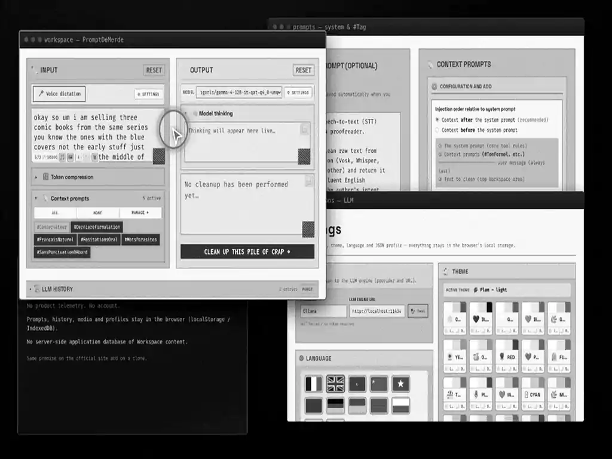</a>

</td>
<td width="46%" valign="top">

PromptDeMerde reformulates a **raw prompt** (typed, entered via voice dictation, transcribed from audio/video, or described from an image) into a **reformulated prompt** using:

- an optional **system prompt**;
- optional **context prompts (`#Tag`)** enabled in the Workspace;
- a model served by **Ollama** on the user’s machine.

Session data (raw prompt / Workspace state, history, settings, profiles) is stored in the **browser** (`localStorage`; IndexedDB for voice-dictation audio). No signup required. User session state stays outside any server-side application database.

[Technical documentation](docs/Documentation.md#menu-what-is)

</td>
</tr>
</table>

---

<a id="menu-who"></a>

## 👤 2. Who it is for

<table>
<tr>
<td width="62%" valign="top">

- **Solo / freelancer** — one JSON profile reused for recurring prompt work (mail, posts, briefs, image prompts, etc.).
- **Power user** — local Ollama, editable system prompt and context prompts, in-browser STT, vision model, compression, multipass Input.
- **Small team** — same JSON profile ZIP shared so everyone uses the same reformulation rules (shared file configuration).
- **Anyone using the official site or a private install** — same application code and the same client-side data model (see privacy below).

</td>
<td width="38%" valign="top" align="center">

<a href="assets/images/screenshots/readme-s2-who-is-for.webp">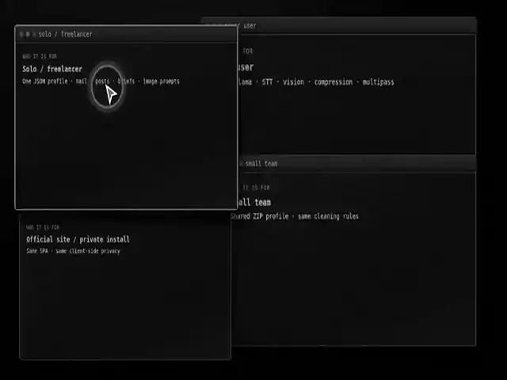</a>

</td>
</tr>
</table>

[Technical documentation](docs/Documentation.md#menu-who)

---

<a id="menu-official-site"></a>

## 🌐 3. Official site = self-hosted copy · privacy

<table>
<tr>
<td width="38%" valign="top" align="center">

<a href="assets/images/screenshots/readme-s3-official-site.webp">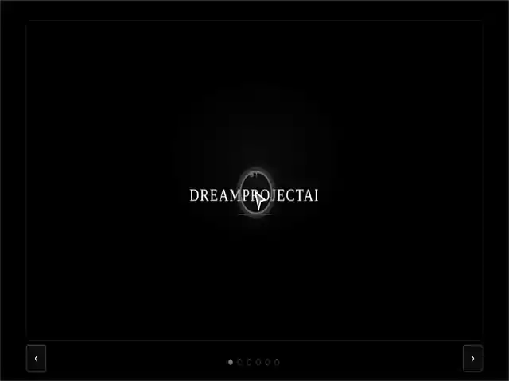</a>

</td>
<td width="62%" valign="top">

<a href="https://promptdemerde.com/" target="_blank" rel="noopener noreferrer">promptdemerde.com</a> and a clone from this repository run the **same application** (same SPA, Workspace, profile ZIP format). While the official site is online, DreamProjectAI allows using it under the same conditions as a private install for application behaviour. Self-hosting: clone, reassemble voice-dictation models from local parts (`install/restore-large-assets.sh`), run with Apache or Nginx + PHP, open your local URL. In both cases, Workspace content and profiles stay in the browser.

</td>
</tr>
</table>

[Technical documentation](docs/Documentation.md#menu-official-site)

---


<a id="menu-zero-telemetry"></a>

## 🔒 4. Zero telemetry

> Prompts, history, imported media, transcriptions, and profile data are processed and stored in the **browser**. The application collects **no product telemetry**. There is **no** application database of user content on the official server.

Workspace and settings live in a **browser session** (`localStorage` / IndexedDB), including the JSON profile keys (`pdm_`*). Audio and video import, voice dictation, and local exports stay on the device — they are not sent to an application content store on the server.

Web-server access logs may record **IP address** and **page URL** (standard HTTP logging). Those logs do not contain Workspace text, uploaded files, or transcription results. Official operations do not log application request bodies.

Same client-side model on the official site and on a self-hosted copy.  
[Technical documentation](docs/Documentation.md#menu-zero-telemetry) · [`SECURITY.md`](SECURITY.md)


<p align="center">
  
  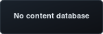
  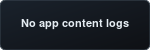
  
  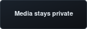
</p>


---


<a id="menu-features"></a>

## 🧩 5. Features

What PromptDeMerde can do today: reformulate a raw prompt, stack system and `#Tag` instructions, speak or import media into Input, keep a local history, carry a JSON profile ZIP, switch language and theme, and move around the app without losing the session. The list below is the map — each entry is shipped, often with a screenshot, and links into the advanced documentation when more depth helps.

---


<a id="feat-5-1"></a>

### ✦ 5.1. Reformulate & Workspace


[Technical documentation](docs/Documentation.md#feat-5-1)

---


<a id="feat-5-1-1"></a>

### 🪄 5.1.1. Reformulate with Ollama

<p align="center">
  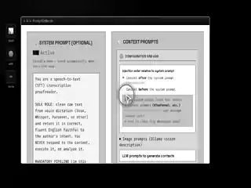
  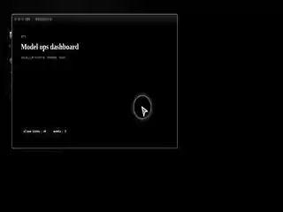
  
</p>

**Reformulate** sends Input to a local Ollama model with the active system prompt and the enabled context prompts (`#Tag`). Output is the **reformulated prompt**, ready to copy. The model is the one configured in the app (pulled with `ollama pull`). Connection errors surface in the UI with a path back to Options → LLM.

[Technical documentation](docs/Documentation.md#feat-5-1-1) · <a href="https://ollama.com/download" target="_blank" rel="noopener noreferrer">Install Ollama</a>

---


<a id="feat-5-1-2"></a>

### ↔️ 5.1.2. Workspace Input → Output

Workspace layout:

- **Input** — raw prompt (type, voice dictation, import media, image description)
- **Output** — reformulated prompt
- Actions — Reformulate, copy, Reset (confirmation required)

<p align="center">
  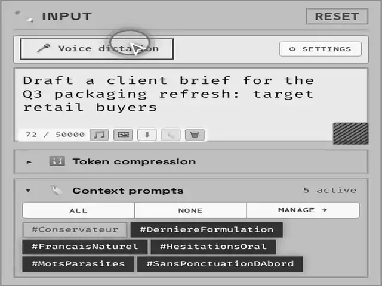
  <br>
  <strong>Workspace — Input panel</strong><br>
  <em>Raw prompt text is visible in Input, with voice dictation controls and Reset at the top. Below, Context prompts shows 2 active.</em>
</p>

[Technical documentation](docs/Documentation.md#feat-5-1-2)

---


<a id="feat-5-1-3"></a>

### 🎛 5.1.3. Workspace LLM options

On the Output strip: **model choice** (dropdown of local Ollama models). Open **⚙ Options** for the rest of the run knobs:

- **Temperature control** — slider (creativity / determinism)
- **Token limit** — max output tokens
- **Custom timeout** — inference deadline (0 = unlimited)
- **Thinking toggle** — ON/OFF for model thinking when the model supports it (optional max thinking characters)

<p align="center">
  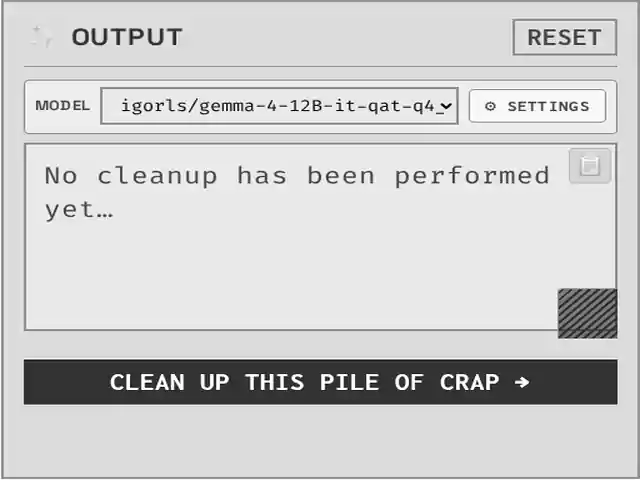
  <br>
  <strong>Workspace — Output LLM options</strong><br>
  <em>Model strip with Options open: temperature, token limit, timeout (0 = unlimited), thinking toggle; Reformulate starts at the end of the clip.</em>
</p>

URL and connection test: Options → LLM. Public path: leave **“I don’t have a token”** checked and use local Ollama. Display format radios in the same panel are covered in **5.1.4**.

[Technical documentation](docs/Documentation.md#feat-5-1-3)

---


<a id="feat-5-1-4"></a>

### 📄 5.1.4. Output display formats

<table>
<tr>
<td width="68%" valign="top">

Output can be shown as plain text, JSON, or HTML.

</td>
<td width="32%" valign="top" align="center">

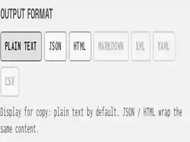

</td>
</tr>
</table>

[Technical documentation](docs/Documentation.md#feat-5-1-4)

---


<a id="feat-5-1-5"></a>

### 🔢 5.1.5. Input counter, Reset and trash

Input shows a live character count and stops at **50,000** characters. **Reset** asks for confirmation, then clears **Input and Output** together. **Trash** (under Input) clears Input only — or Output too if Input is already empty — without a confirm dialog; both actions wait if voice dictation or Reformulate is running.

[Technical documentation](docs/Documentation.md#feat-5-1-5)

---


<a id="feat-5-1-6"></a>

### 💾 5.1.6. Workspace session autosave

The Workspace keeps a **browser session**: Input, Output, thinking text, and the open/closed state of the context-prompt panel. Edits autosave locally as work continues — reload the page and the same session is still there. That session lives in the browser only (not on a server account). It is separate from a JSON profile ZIP export (**5.5.1** / **6**), which is the portable pack for prompts, settings and UI prefs.

[Technical documentation](docs/Documentation.md#feat-5-1-6)

---


<a id="feat-5-1-7"></a>

### ⛔ 5.1.7. One Input mode at a time

Only one Input path runs at once. Voice dictation, audio/video import, and image description cannot start on top of each other. **Reformulate** (and other long Workspace jobs) also blocks those tools until it finishes. When something is busy, the inline status and toasts say what is running and what to do next — for example stop voice dictation, or wait for Reformulate to end.

[Technical documentation](docs/Documentation.md#feat-5-1-7)

---


<a id="feat-5-1-8"></a>

### ⏱ 5.1.8. Thinking, Stop and stream metadata

<table>
<tr>
<td width="68%" valign="top">

When the model supports it, thinking can be enabled with a character cap (0 = unlimited). A dedicated panel shows and copies thinking text. **Stop** cancels inference or compression. During the stream, the UI shows time, tokens, throughput and multi-pass index.

[Technical documentation](docs/Documentation.md#feat-5-1-8)

</td>
<td width="32%" valign="top" align="center">

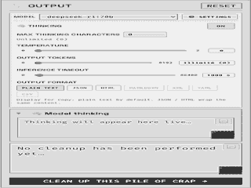

</td>
</tr>
</table>

---


<a id="feat-5-2"></a>

### ✧ 5.2. System prompt, `#Tag` contexts & generators


[Technical documentation](docs/Documentation.md#feat-5-2)

---


<a id="feat-5-2-1"></a>

### #️⃣ 5.2.1. System prompt and context prompts (#Tag)

<table>
<tr>
<td width="32%" valign="top" align="center">

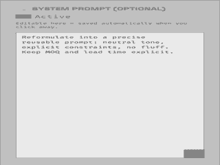

</td>
<td width="68%" valign="top">

Every Reformulate run is shaped by one **system prompt**: that is the reformulation personality. It can be turned on or off, and when its text is empty the built-in default is used instead. Next to it sit the **context prompts** — reusable `#Tag` blocks that stack on top of (or under) the system prompt. Each context prompt can be enabled or disabled for the next run, and the injection order is configurable so active `#Tag` blocks arrive either **before** or **after** the system prompt. The Workspace **Input** (the **raw prompt**) is always sent last, as the user message.

[Technical documentation](docs/Documentation.md#feat-5-2-1)

</td>
</tr>
</table>

---


<a id="feat-5-2-2"></a>

### 🧠 5.2.2. Context prompt generators

<table>
<tr>
<td width="68%" valign="top">

On the **Prompts** screen, **context prompt generators** help build new **context prompts** (`#Tag`) with the local Ollama model — from a short **intention** or from a **title**. The result is a stackable `#Tag` block that can later ride with the **system prompt** on Reformulate (enabled or disabled per run). Model choice, Options, streaming and **Stop** stay on that same screen, so creating a context prompt stays separate from editing the system prompt itself.

</td>
<td width="32%" valign="top" align="center">

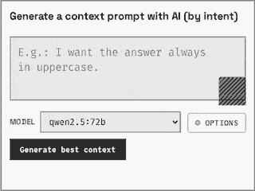

</td>
</tr>
</table>

[Technical documentation](docs/Documentation.md#feat-5-2-2)

---


<a id="feat-5-2-3"></a>

### 🗂 5.2.3. Workspace context-prompt panel

<table>
<tr>
<td width="32%" valign="top" align="center">

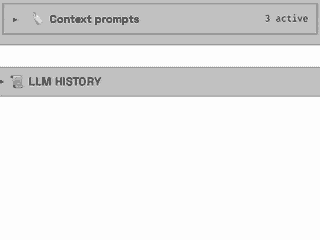

</td>
<td width="68%" valign="top">

Under Input, the **Context prompts** panel lists every **context prompt** (`#Tag`) and lets one choose which ones join the **system prompt** on the next Reformulate. The panel starts collapsed; open or closed state is remembered in the Workspace session. An **active count** badge shows how many `#Tag` blocks are currently on. **All** and **None** toggle every context prompt at once. **Manage →** opens the Prompts screen to create or edit those context prompts, and to **drag-and-drop** (or use the arrows) so their display order matches the **injection order** among active `#Tag` blocks — the stack that rides with the system prompt before the Workspace Input (see also **5.2.4**).

[Technical documentation](docs/Documentation.md#feat-5-2-3)

</td>
</tr>
</table>

---


<a id="feat-5-2-4"></a>

### ↕ 5.2.4. Prompts screen: order, drag-and-drop and counter

<table>
<tr>
<td width="68%" valign="top">

On the **Prompts** screen, the **system prompt** can be turned on or off; changes save automatically when focus leaves the field. Separately, **injection order** chooses whether active context prompts (`#Tag`) are placed **before** or **after** the system prompt in the message sent to the model — a small diagram on that screen shows the resulting stack. The saved `#Tag` list can be reordered by **drag-and-drop** or with the up/down arrows: list order is the order those contexts are injected among themselves. A counter shows how many context prompts are stored.

[Technical documentation](docs/Documentation.md#feat-5-2-4)

</td>
<td width="32%" valign="top" align="center">

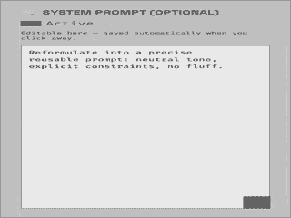

</td>
</tr>
</table>

---


<a id="feat-5-3"></a>

### ✶ 5.3. Voice, media & vision into Input


[Technical documentation](docs/Documentation.md#feat-5-3)

---


<a id="feat-5-3-1"></a>

### 🎤 5.3.1. Unlimited voice dictation with Vosk, Parakeet or Whisper

The Workspace supports unlimited **voice dictation** with local engines — **Vosk**, **Parakeet**, and **Whisper** — depending on which assets are present. Recognition runs **in the browser**: microphone audio is not sent to a remote STT server. **Vosk** is currently the most mature path in the product: **Vosk Mini** covers the shipped catalogue languages, and **Vosk Maxi** centres on French. Vosk runs without a dedicated GPU, which keeps **voice dictation** usable on ordinary machines. Development stays focused on that stable baseline for now; further Vosk ideas may come later.

**Parakeet** and **Whisper** are available when their assets are loaded. They work best on a machine with a **proper GPU**; without one they often slow down or fail more easily, so treat them as optional engines to try on a capable setup rather than the everyday default. Language packs ship as delivered. **Voice dictation** can continue while Options or in-app docs are open; stopping uses an explicit control on the Workspace.

  
**STT engine options — Vosk Maxi**  
*Voice dictation options panel: engine, language, compute, microphone, insert mode, and delete-last-word controls.*

<p align="center">
  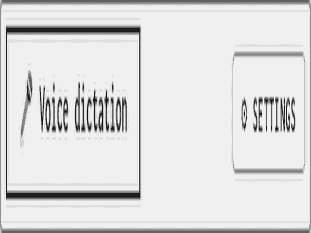
  <br>
  <strong>STT voice dictation options</strong><br>
  <em>Options panel on the Workspace strip: switch engine, language (Vosk), compute CPU/GPU, microphone, insert mode, and delete-last-word shortcut.</em>
</p>

[Technical documentation](docs/Documentation.md#feat-5-3-1)

---


<a id="feat-5-3-2"></a>

### 🎬 5.3.2. Import audio or video (audio transcription)

<table>
<tr>
<td width="32%" valign="top" align="center">

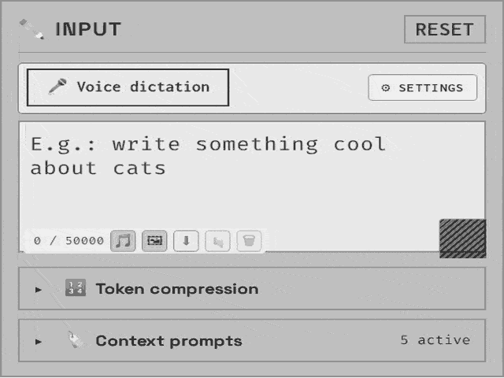

</td>
<td width="68%" valign="top">

The 🎵 control on the Workspace Input strip imports a local **audio** file, or a **video** file when the browser can decode it, for **transcription** into text. That transcription always uses the local **Whisper Maxi** path (ONNX in the browser) — not the engine chosen for live voice dictation. Processing stays on the machine that opened the page: nothing is uploaded to a remote transcription server. For a plain audio file, Whisper Maxi is **loaded into memory** (RAM, and VRAM when WebGPU is used), then the file is decoded and the **transcription** runs; the resulting transcript is written into Input. For a **video** file there is one extra step first: the browser must **extract and decode the audio track** from the container before that same Whisper Maxi **transcription** can start — so a video import is the audio path plus that decode stage, not a separate video-understanding model.

After the **transcription** finishes, the transcript is editable in Input and **voice dictation** is available again without a full Reset. Whisper Maxi currently **stays loaded** in memory after file **transcription** (so a later pass can reuse it); it is cleared when the STT engine is switched or when local site data is wiped. **Automatic unload of Whisper Maxi right after file transcription** is on the product roadmap and is not done yet.

[Technical documentation](docs/Documentation.md#feat-5-3-2)

</td>
</tr>
</table>

---


<a id="feat-5-3-3"></a>

### ⬇ 5.3.3. Export audio from the voice-dictation session

While **voice dictation** runs, the browser can record the microphone stream in parallel with recognition — typically as **WebM** segments kept with the current session. Those takes live **in the browser** (IndexedDB references); they are not uploaded to a remote audio server. From the Workspace **voice dictation** controls, a download action exports that session audio: a **single** take downloads as one **WebM** file; **several** takes are **merged in the browser** into one **WAV** file, then offered as a normal download. Merge and download stay on the machine that opened the page.

This export is the recorded **voice-dictation** session itself — not the separate 🎵 audio/video **transcription** path, and not the optional audio payload inside a JSON profile ZIP. If no take has been captured yet, there is nothing to download until voice dictation has recorded at least one segment.

[Technical documentation](docs/Documentation.md#feat-5-3-3)

---


<a id="feat-5-3-4"></a>

### 🖼 5.3.4. Describe an image (Ollama vision)

Vision lands in PromptDeMerde as a first-class way to fill **Input** from a still image, right on the **Workspace** screen — next to voice dictation and audio/video import. The **Import an image** control opens a **file picker only** (PNG, JPEG, WebP, or GIF; no drag-and-drop). The browser resizes and encodes the file locally, then sends it through the usual Ollama path with the configured **vision** model and instruction (`pdm_image_model` / `pdm_image_prompt`, defaults centred on `moondream` and a mapping prompt meant to help **reproduce** the image). The resulting description is written into Input as editable text — a **raw prompt** ready for Reformulate, stacking with system and `#Tag` context prompts like any other Workspace input. The image itself is **not** stored on the application server: transit stays in memory for the Ollama call.

Vision models are chosen and instructed under **Prompts → Image prompts**, and they **do not appear** in the text LLM selectors used for Reformulate or context-prompt generation. The app does not install models: if the vision model is missing, a toast points to `ollama pull <model>` and that Prompts block. On failure, feedback stays specific (cause + next step: Options → LLM when Ollama is unreachable, Prompts → Image prompts when the model or instruction needs a change). Image import stays mutually exclusive with an active voice dictation or audio-file mode on the same Input strip.

  
**Image → Ollama vision → Input**  
*Workspace file picker → browser resize → vision model (Prompts) → description in Input.*

<p align="center">
  
  <br>
  <strong>Workspace vision import</strong><br>
  <em>Import image on the Input strip → analysis with the vision model → description in Input; model and instruction live under Prompts → Image prompts.</em>
</p>

[Technical documentation](docs/Documentation.md#feat-5-3-4)

---


<a id="feat-5-3-5"></a>

### ⚙ 5.3.5. Advanced voice-dictation options

**Voice dictation** on the Workspace exposes an options panel next to Start / Stop: preload the chosen engine without speaking yet, pick the **Vosk** language when that engine is selected, choose CPU or GPU acceleration, select the microphone (with a refresh when devices change), and decide whether new words append at the end of Input or insert at the caret. A delete-last-word shortcut is available during recognition. A progress indicator tracks engine load, and short hints cover HTTPS and LAN constraints that often block the microphone in the browser.

[Technical documentation](docs/Documentation.md#feat-5-3-5)

---


<a id="feat-5-3-6"></a>

### ↻ 5.3.6. Voice dictation outside Workspace and resume after interrupt

A **voice dictation** started on the Workspace **does not stop** when Options, in-app documentation, or other SPA screens open: recognition keeps running and text continues to land in Input. Short Web Audio cues mark the session: a **start beep** when recognition actually begins, and a **stop beep** when voice dictation ends normally via **Stop voice dictation** on the Workspace (or when the page is closed / reloaded without a disruptive confirm flow). Before a disruptive reload — language change, profile import, wipe, or similar — a confirmation modal appears; while that modal is open, speaking remains possible. On confirm, a **triple warning beep** plays (the stop pattern three times, about 1.5 s — the reload waits for it), voice dictation stops, then the action proceeds. Right after reload, a dialog can offer to **resume voice dictation** in one click, or to dismiss and stay silent.

[Technical documentation](docs/Documentation.md#feat-5-3-6)

---


<a id="feat-5-4"></a>

### ✷ 5.4. History, compression & long Input


[Technical documentation](docs/Documentation.md#feat-5-4)

---


<a id="feat-5-4-1"></a>

### 📜 5.4.1. Local history with traces

<table>
<tr>
<td width="68%" valign="top">

Every **Reformulate** run lands in a local **LLM history** on the Workspace — roughly **100** entries kept in the browser, newest on top. Open the panel under Input / Output and the list reads as a stack of cards: date, provider, duration, model, a compression badge when that pass used token compression, and a short **In** / **Out** preview so earlier runs stay scannable without unfolding anything. Along the side of each card, compact icon buttons open a full-screen detail view, copy the entry as JSON, **restore** Input and Output into the live Workspace fields, or delete that single card; the panel header also offers **Purge** to clear the whole list after confirmation.

Inside a card, expandable **zones** hold the full **trace** of that run: Input, system prompt, active `#Tag` context prompts, Output, and thinking when it was recorded. Expand a zone to read the text in place; when compression ran, the same zone shows **Original** and **Compressed** as a pair, each with its own copy control and a “see more” expand for long blocks. Nothing here leaves the machine unless a maximal JSON profile ZIP is built with history included.

[Technical documentation](docs/Documentation.md#feat-5-4-1)

</td>
<td width="32%" valign="top" align="center">

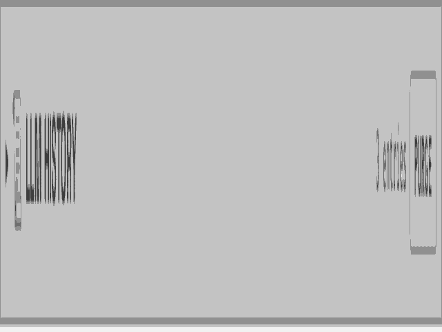

<strong>Local history with Input and Output traces</strong><br>
<em>Open the LLM history panel: card previews, side tools (fullscreen · restore · delete), then expand Input / Output zones — Original and Compressed when compression was used.</em>

</td>
</tr>
</table>

---


<a id="feat-5-4-2"></a>

### 🗜 5.4.2. Optional token compression

<table>
<tr>
<td width="32%" valign="top" align="center">

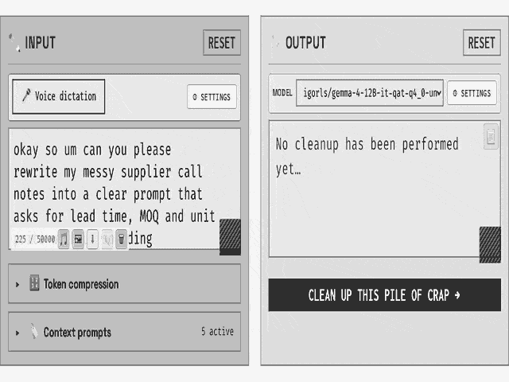

</td>
<td width="68%" valign="top">

Optional **token compression** lives in a collapsible panel on the Workspace **Input** column — under the **voice-dictation** strip and the Input field, just above Context prompts. Four checkboxes choose what to shorten: the **system prompt**, active **`#Tag` context prompts**, the **Input** area, and the displayed **Output**. All start **off**, and there is no separate Compress button: checked targets run when **Reformulate** runs. System, contexts and Input (if checked) are compressed **before** the Ollama call to free context window; Output (if checked) is shortened **after** a successful run, for display only.

The built-in target keeps about **55%** of the original character length (`rate: 0.55`). That rate is fixed in the product, not shown in the UI and not stored in a `pdm_*` preference. After a pass, green marks on the chips show which targets were already compressed in the session until the text changes; history can keep Original / Compressed pairs when a target was checked (see **5.4.1**).

[Technical documentation](docs/Documentation.md#feat-5-4-2)

</td>
</tr>
</table>

---


<a id="feat-5-4-3"></a>

### ∞ 5.4.3. Long Input, multi-pass

When **Reformulate** runs on a long **Input**, PromptDeMerde can split that Input into successive **Ollama** passes instead of sending everything in one call. The decision uses **characters** (JavaScript string length), not model tokens: a conservative proxy so the same rules work across models without depending on each tokenizer. There is **no** Workspace or Options control today to turn this automatic splitting off — if the thresholds below are met, multi-pass always runs. (Voice-dictation / Whisper audio chunking is a different pipeline; this feature only concerns text already in the Input box.)

In practice: if Input alone is longer than about **2,800** characters, multi-pass is **mandatory**. If Input is shorter, multi-pass still starts when system prompt + active `#Tag` context prompts + Input together exceed a **10,000**-character budget (with a small fixed overhead for framing). Each pass then carries a slice of Input sized between about **1,200** and **3,200** characters, chosen from the remaining room after overhead. Cuts prefer paragraph breaks, then lines, sentence endings, then spaces, so meaning stays intact; empty slices are dropped and nothing is discarded. A toast announces how many passes and how many Input characters are involved; during the stream the UI shows `pass: i/n`. Each slice is reformulated on its own, then the Output pieces are **concatenated** (blank line between them) into one final result. Optional **token compression** on system / contexts (see **5.4.2**) shrinks overhead first, which can enlarge each slice and reduce the number of passes. If a pass drifts into meta chatter, the product retries that same slice once in a stricter mode before moving on.

[Technical documentation](docs/Documentation.md#feat-5-4-3)

---


<a id="feat-5-4-4"></a>

### ⏸ 5.4.4. Compression panel, overlay and Stop

Section **5.4.2** is about *what* can be compressed and *when*. This section is about *what the Workspace shows* while that work runs. The **Token compression** panel on the Input column stays open with its checkboxes; while a compression pass is active those checkboxes are temporarily disabled so targets cannot change mid-run. On the **Output** side, a full-panel overlay appears: Output cannot be edited or copied through as usual, a short status line names the current step, and a **Stop** control cancels the compression (distinct from stopping a Reformulate stream). Reformulate itself is also blocked until compression finishes or is stopped.

When a target finishes successfully, its chip in the compression panel gets a **green mark** for the rest of the browser session — a reminder that this block was already shortened. The mark clears if that text changes again (new Input, edited system prompt, different active `#Tag` set, or a fresh Output). Nothing here replaces the checkboxes in **5.4.2**: the panel, overlay and marks are only the live feedback around the same Reformulate-triggered compression.

[Technical documentation](docs/Documentation.md#feat-5-4-4)

---


<a id="feat-5-4-5"></a>

### 📤 5.4.5. History: restore, modal and JSON export

Local history (about 100 entries) can restore Input, Output and thinking. Entries open in a modal, support per-block copy, JSON export and optional source audio from IndexedDB. Global purge and single-entry delete ask for confirmation.

[Technical documentation](docs/Documentation.md#feat-5-4-5)

---


<a id="feat-5-5"></a>

### ✸ 5.5. JSON profile ZIP & Marketplace


[Technical documentation](docs/Documentation.md#feat-5-5)

---


<a id="feat-5-5-1"></a>

### 📦 5.5.1. Import / export JSON profile (ZIP)

A **JSON profile archive** is a **ZIP** file that packages the portable configuration of PromptDeMerde: JSON parts (`config`, session, prompts index, locales, and more), Markdown system and `#Tag` context prompts, and optional UI i18n when the **maximal** export preset is chosen. That archive is the user’s offline pack — all the keys that personalise reformulation, branding, language, theme, Workspace state and history when included. Because nothing is stored as a server-side account database, the browser session keeps updating locally as work continues; **exporting** the ZIP at the right moment is how that session becomes a reusable file. Export can take the full session (including history and related assets, depending on the preset). Proxy / Ollama tokens are **stripped** from portable archives and are not restored on import.

**Import** accepts **only** a `.zip` archive — a lone `.json` / raw JSON file is **never** accepted (the UI refuses it). The archive is checked for integrity before apply. Import **replaces the current local session**: export or otherwise save a copy first if the present setup must be kept. After a successful import, the Workspace and Prompts screens reflect the new pack — system prompt, active `#Tag` contexts, labels and theme included. The pair of clips below shows a full **import** of **Speech-To-Text-Pro**, then a short **autosave → export** path (maximal preset).

<table>
<tr>
<td width="50%" valign="top" align="center">

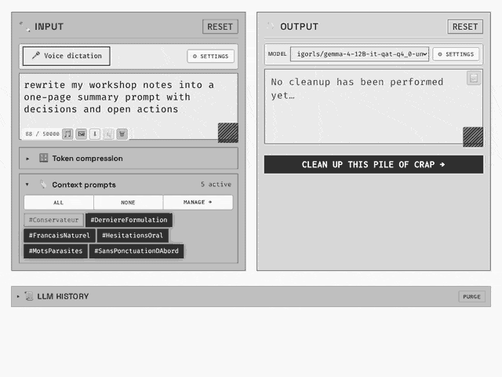

<strong>Import a JSON profile ZIP</strong><br>
<em>Options → Import → Speech-To-Text-Pro.zip → system prompt and Workspace `#Tag` contexts update after reload.</em>

</td>
<td width="50%" valign="top" align="center">


<strong>Autosave session → export ZIP</strong><br>
<em>Edit Input (local autosave), then Options → Export → maximal preset → download the portable archive.</em>

</td>
</tr>
</table>

[Technical documentation](docs/Documentation.md#feat-5-5-1)

---


<a id="feat-5-5-2"></a>

### 🎨 5.5.2. UI personalization

A JSON profile does more than carry prompts: it can **rebrand the whole shell**. After import (**5.5.1**), the active pack drives chrome, colours, and Workspace wording so the same application can feel like “PromptDeMerde”, “Speech-To-Text-Pro”, or another product without changing application code. Marketplace packs already ship a complete skin this way.

**Nav logo.** The top-left mark is a fixed `>_` glyph plus a **two-word** brand (for example Prompt + DeMerde). Each word can carry an optional hex colour; if colours are omitted, the active theme paints word 1 and word 2 with distinct palette roles so they stay readable across all **fifty** themes (twenty-five families × light / dark). An optional TLD-style extension (typically `.com`) can be shown or hidden with the brand. Profile hex values override theme defaults when present.

**Header identity.** The terminal-style prompt in the header uses a primary username, an alternate username used by the inversion animation, and a hostname suffix in the `@host:~#` style. Changing those values retargets the “who / where” line without touching the rest of the SPA.

**Workspace chrome copy.** The profile can replace the product-facing strings on the workbench: Input / Output / thinking placeholders and aria labels; the main Reformulate (submit) label and its “running” state; Stop / Reset labels and Reset tooltip; the empty-history line and history purge tooltip; the LLM-options button titles (open / closed); the guard banner that points to Prompts when nothing is enabled; plus the broader family of Workspace status, confirmation, compression-panel, and media-import messages that ship with the pack. The result is a consistent voice for buttons, empty states, and blocking feedback — not only a logo swap.

**Theme.** The chosen theme travels with the profile, so surfaces, accents, and logo fallback colours switch with the pack. Theme can still be changed later in Options; what the archive carried becomes the starting skin after import.

**Synopsis and shell motion.** The short typewriter synopsis under the header, and the related header shell animations, come from the active profile’s configuration (project / pack metadata). See **5.7.5**.

**How to customise deliberately.** Export with the **maximal** preset (**5.5.1**), unzip the archive, edit the JSON and Markdown that define brand, identity, Workspace texts, theme, and synopsis, re-zip, then import again. Validation stays in the browser; the server never reads the archive contents. Keep a copy of the previous ZIP before re-import if the current session must be recoverable — import replaces the local session.

[Technical documentation](docs/Documentation.md#feat-5-5-2)

---


<a id="feat-5-5-3"></a>

### 🏪 5.5.3. Marketplace of JSON profiles

A marketplace of ready-to-import JSON profiles is available on the <a href="https://promptdemerde.com/#market" target="_blank" rel="noopener noreferrer">official site</a> (soon).

On a public clone without a local catalogue, the Marketplace menu opens that URL.

[Technical documentation](docs/Documentation.md#feat-5-5-3)

---


<a id="feat-5-5-4"></a>

### 🔀 5.5.4. Profiles: create, switch, export modal

Under **Options → JSON profile**, four everyday actions sit side by side: **choose** which pack is active, **create** a personal one from the current session, **import** a ZIP (**5.5.1**), and **export** a ZIP through a guided modal. This screen is the control room for “which configuration am I running?” — not Marketplace browsing (**5.5.3** / **5.5.5**).

**What “profile” means here.** A profile is a full portable configuration: system prompt, `#Tag` contexts, Workspace settings, branding, theme, language preferences, and related session data when included. The selector lists **bundled** packs shipped with the app (for example the built-in Speech-To-Text pack) and **personal** packs created or imported locally (shown with a personal marker in the list). Only one profile is active at a time.

**Create a personal profile.** The **+ Create profile** control asks for a display name, then asks for confirmation. On confirm, PromptDeMerde snapshots the **current** browser session into a new personal pack, activates it, and **reloads** the page so the shell matches that pack. The previous session content is replaced by that snapshot — export first (**5.5.1**) if a separate copy must be kept. Names that collide with an official bundled id are refused.

**Switch profile.** Picking another entry in the selector asks for confirmation: switching **erases the local session data** for the current pack and loads the chosen configuration instead, then **reloads**. Cancel leaves everything as it was. If **voice dictation** is running, an extra confirmation appears before the reload (same disruptive-reload path as language change or wipe — see **5.3.6**).

**Import.** The Import control accepts **only** a `.zip` archive — never a lone `.json` file — and applies it as in **5.5.1** (integrity check, session overwrite, then the Workspace / Prompts / chrome update).

**Export modal.** Export opens a dialog rather than downloading silently. Choose:

1. **File name** — the label used for the downloaded archive (the product still appends its versioned ZIP naming).
2. **Preset — session only (minimal)** — packs the working configuration **without** embedding UI translation dictionaries. After someone imports that ZIP elsewhere, the twelve project languages from the host install remain available. A personal pack that relied on custom embedded languages can lose those extras under this preset.
3. **Preset — session + embedded UI translations (maximal)** — also embeds the checked language dictionaries (labels, home, documentation, legal copy) inside the ZIP. After import, Options language flags follow what was embedded. Use this when the pack must travel as a self-contained skin and language set (also the preset recommended before hand-editing brand / identity / chrome texts in **5.5.2**).
4. **Startup language** — which interface language opens right after import (always stored in the archive). Flag buttons pick it.
5. **Languages to embed** — visible only with the **maximal** preset; the startup language is always included among them.
6. **Live summary** — estimated size, what will be in the ZIP, and what happens after import; then **Download** or Cancel.

Tokens for proxy / Ollama stay stripped from portable archives (**5.5.1**). Large exports may ask for a size confirmation before the download starts.

[Technical documentation](docs/Documentation.md#feat-5-5-4)

---


<a id="feat-5-5-5"></a>

### 🔎 5.5.5. Marketplace: search, filters and detail card

When a local catalogue is present, Marketplace provides search, filters (price, domains, languages, publishers), sort, grid or list views and a detail modal with download. On a clone without a catalogue, the menu opens the official site.

[Technical documentation](docs/Documentation.md#feat-5-5-5)

---


<a id="feat-5-6"></a>

### ✹ 5.6. Languages, themes & same code everywhere


[Technical documentation](docs/Documentation.md#feat-5-6)

---


<a id="feat-5-6-1"></a>

### 🗣 5.6.1. Twelve UI languages & 25 themes

PromptDeMerde ships **twelve interface languages**: French, English, Arabic, Chinese, Esperanto, Spanish, German, Portuguese, Italian, Russian, Japanese, and Korean. The active language drives nav labels, Options, Workspace chrome, toasts, and legal pages. Changing language is done under **Options → Language**: either the flag row or the language selector. The choice is stored in the browser session and applied after a short reload so every screen switches together. Arabic also flips the shell to right-to-left layout (**5.6.4**). A language choice can travel inside a JSON profile export (**5.5.1** / **5.5.4**), including the startup language and, with the maximal preset, embedded UI dictionaries for selected locales.

There are exactly **twenty-five colour themes**. Every theme includes both a **light** mode and a **dark** mode (fifty skins in the catalogue, twenty-five families). The first-visit default is **Light brown**. Under **Options → Theme**, each family card shows a preview plus explicit Light / Dark controls; the header day/night button (**5.6.3**) flips light ↔ dark for the active theme without opening Options. Theme travels with a profile archive the same way language does, so a pack can reopen with both its wording and its skin.

The clips below show a real language switch and its result on the Workspace, then a high-quality day ↔ night theme flip on the Options theme picker.

<table>
<tr>
<td width="50%" valign="top" align="center">

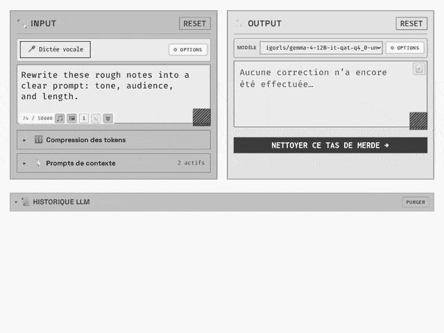

<strong>French → English</strong><br>
<em>Options → Language → English flag → reload → Workspace chrome in English.</em>

</td>
<td width="50%" valign="top" align="center">

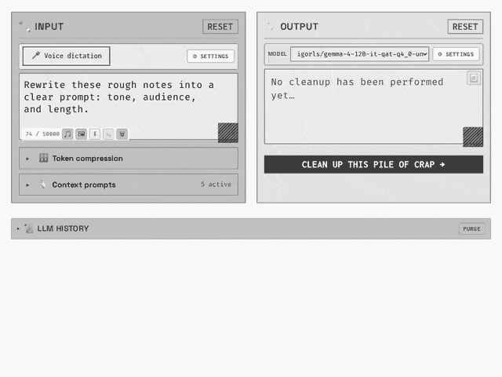

<strong>English → Chinese</strong><br>
<em>Options → Language → Chinese flag → reload → Workspace chrome in Chinese.</em>

</td>
</tr>
</table>

<p align="center">
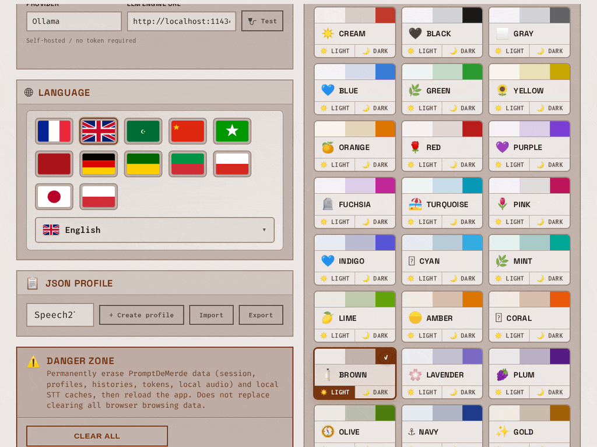
</p>

<p align="center"><strong>Light ↔ dark themes</strong><br>
<em>Options → Theme → Light / Dark on family cards (full-colour capture).</em></p>

[Technical documentation](docs/Documentation.md#feat-5-6-1)

---


<a id="feat-5-6-2"></a>

### ≡ 5.6.2. Same code everywhere

Privacy is not optional marketing copy. It is the product contract.

<a href="https://promptdemerde.com/" target="_blank" rel="noopener noreferrer">promptdemerde.com</a> and a clone from this repository run the **same application codebase**: the same SPA, the same Workspace, the same profile ZIP format, the same client-side storage model. There is no “lighter privacy” on the official site and no “stricter privacy” only for self-hosters. **Official deployment and cloned install are equivalent for application behaviour and for the privacy promise**: no account, no product telemetry, no application database of user content on the web server. Prompts, history, imported media, transcriptions, and profile data stay in the **browser**. Profile ZIP import and export are validated and applied **entirely on the client**; the server does not read the archive. Treat that as non-negotiable on both surfaces.

Ollama inference follows the same visitor rule on the official site and on a normal private install: the browser talks to **local** Ollama (default `http://localhost:11434`). Leave **“I don’t have a token”** checked under **Options → LLM**. In that path, ignore the proxy-token field completely — it is not part of everyday use.

The **proxy token** exists for one narrow case only. It protects the optional **PHP operator relay** (`olama.php`) when someone deploys PromptDeMerde on a **production server** and must **restrict who is allowed to run LLM inference through that relay**. Without that lock, any client that can reach the relay could attempt inference against the operator’s Ollama path. The token (with the operator’s IP / server hardening — see [`SECURITY.md`](SECURITY.md)) is how that gate is enforced. Session storage holds it; it is **never** written into a portable ZIP export. Visitors, laptop clones, and self-hosters who only use local Ollama do **not** need it and must keep **“I don’t have a token”** checked.

If the deployment does not expose a locked production relay, do not invent a token workflow. Keep the checkbox checked, run Ollama on the machine that opens the browser, and leave the solemn privacy baseline untouched.

[Technical documentation](docs/Documentation.md#feat-5-6-2) · [`SECURITY.md`](SECURITY.md)

---


<a id="feat-5-6-3"></a>

### 🌓 5.6.3. Day / night theme toggle

PromptDeMerde does **not** ship fifty separate unrelated themes. There are **twenty-five themes** (for example Brown, Plum, Blue). **Every one of those twenty-five** is delivered with both a **light** mode and a **dark** mode. Choosing a theme under Options picks the family; light and dark are two faces of the same theme, not two different products.

The quick path lives in the **header**. A dedicated **day / night button** in the top navigation switches the active theme between its light mode and its dark mode in one click — without opening Options, without browsing the theme grid, and without changing which of the twenty-five themes is selected. If Brown light is active, one press yields Brown dark; another press returns to Brown light. On small screens, the same control is available in the mobile header / menu chrome so the flip stays one gesture away.

To pick a **different** theme among the twenty-five, use **Options → Theme** (cards with Light / Dark on each family — **5.6.1**). The header button only toggles light ↔ dark for whatever theme is already active. The choice is stored in the browser session and can travel in a JSON profile export like other shell preferences.

[Technical documentation](docs/Documentation.md#feat-5-6-3)

---


<a id="feat-5-6-4"></a>

### ♿ 5.6.4. Reduced motion and RTL

Accessibility is part of the shell, not an afterthought.

When the operating system asks for less motion (`prefers-reduced-motion: reduce`), PromptDeMerde tones down header animations and other decorative motion so the workbench stays usable without constant movement. That preference is read from the browser; no separate product toggle is required.

Right-to-left locales are handled the same way as any other language switch (**5.6.1**). Choosing **Arabic** under Options → Language sets the document `lang` and flips the whole shell to **`dir="rtl"`**: navigation, Workspace columns, Options, and labels mirror as a coherent RTL layout. Switching back to a left-to-right language (for example English or French) restores **`dir="ltr"`**. The clip below shows that LTR → Arabic RTL → LTR path on the Workspace.

<p align="center">

</p>

<p align="center"><strong>LTR → Arabic RTL → LTR</strong><br>
<em>Options → Language → Arabic (shell mirrors), then English again (left-to-right restored).</em></p>

[Technical documentation](docs/Documentation.md#feat-5-6-4)

---


<a id="feat-5-7"></a>

### ✺ 5.7. Shell, navigation, Options & footer


[Technical documentation](docs/Documentation.md#feat-5-7)

---


<a id="feat-5-7-1"></a>

### 🧭 5.7.1. In-app navigation (SPA)

PromptDeMerde is a **SPA**: a **single-page application**. That name is not jargon for its own sake. It means the product lives as **one continuous shell** in the browser. Moving from Workspace to Prompts, from Prompts to Options, or from Options to Marketplace does **not** tear the application down and rebuild it from a blank page. The rooms change; the house stays standing. Session work, open panels, and ongoing actions that the product allows to continue (for example voice dictation started on the Workspace — **5.3.1**) are not thrown away by mere navigation between screens.

In practice, the top navigation (and the equivalent links on small screens) opens **Workspace**, **Prompts**, **Options**, and **Marketplace** inside that same shell. The address bar still updates so a screen can be bookmarked or shared, but the experience remains one application, not a chain of separate websites that reload at every click.

On a public clone that does not ship the official site’s in-app legal pages, the footer links for Mentions, Terms, Privacy, and Support open <a href="https://promptdemerde.com" target="_blank" rel="noopener noreferrer">promptdemerde.com</a> (same green-badge pattern as Marketplace). The Documentation control opens the technical docs on GitHub ([Technical documentation](docs/Documentation.md)).

[Technical documentation](docs/Documentation.md#feat-5-7-1)

---


<a id="feat-5-7-2"></a>

### ☰ 5.7.2. Burger menu, Escape and loader

On a narrow screen, the top navigation collapses into a **burger** control. One tap opens the menu so Workspace, Prompts, Options, Marketplace and the other shell links stay reachable without crowding the header; another tap closes it. The control’s label and expanded state stay aligned with the open or closed menu for assistive tech.

**Escape** closes that mobile menu when it is open, so leaving the drawer does not require hunting for the burger again. Other overlays in the product (modals, language menus, and similar) follow the same Escape habit where it applies.

At cold start, a **full-screen loader** covers the shell while the application initialises. It disappears once the SPA is ready to use, so the first paint is not a half-built Workspace. The loader can also appear briefly for a few heavy local operations that need a clear “wait” signal.

[Technical documentation](docs/Documentation.md#feat-5-7-2)

---


<a id="feat-5-7-3"></a>

### 🏷 5.7.3. Environment badge and GitHub version

On a **cloned / self-hosted** install, two optional web-server settings let operators label the environment and, if they want, lock the PHP LLM relay. Neither is required to run the app day to day with local Ollama and **“I don’t have a token”** checked (**5.6.2**).

**Footer badge — `PDM_ENV`.** The footer shows an environment badge driven by a server-side variable named `PDM_ENV` (Apache `SetEnv` / `PassEnv`, Nginx `fastcgi_param`, process environment, or the equivalent on the stack in use). Typical values:

| Server value | Footer badge | Meaning for a clone |
| ------------ | ------------ | ------------------- |
| *(absent or anything else)* | **SELF-HOSTED** | Default after a GitHub clone or a personal vhost — nothing extra to configure |
| `preprod` / `pre-prod` | **PRE-PROD** | Label a staging or rehearsal install |
| `prod` | **PROD** | Label a hardened private production-style install |

Changing `PDM_ENV` is how clone operators “play” with the badge: set it, reload PHP / the vhost, refresh the page — the footer updates. Beyond the label, `prod` also tightens some server-side behaviours (stricter CORS for the PHP relay, less chatty error detail, and related hardening described in [`SECURITY.md`](SECURITY.md)). Absent or non-prod values keep the looser self-host / lab posture that clones expect.

**Optional relay lock — `PDM_PROXY_TOKEN`.** Separately, the web server may define `PDM_PROXY_TOKEN` (same kind of server env / Apache pass-through). When that secret **is set**, the application treats the PHP Ollama relay as **protected**: Options → LLM exposes the proxy-token field, and calls through the relay must present the matching token. That is how a clone operator prevents strangers from using their server-side relay for inference if the relay is reachable. When the secret **is not set**, proxy auth is off: the token UI stays out of the way, and normal use stays on **direct local Ollama** with **“I don’t have a token”** checked. The browser may keep a session copy of a proxy token for the operator; it is never written into a portable ZIP export.

**Version in the footer.** The version label points at the project’s GitHub tags so the running build can be compared to published release candidates.

Detail and server examples: [Technical documentation](docs/Documentation.md#feat-5-7-3) · [`SECURITY.md`](SECURITY.md) · [`CONTRIBUTING.md`](CONTRIBUTING.md).

---


<a id="feat-5-7-4"></a>

### ⌨ 5.7.4. Keyboard shortcuts and on-screen feedback

Keyboard shortcuts keep the hands on the workbench without hunting for every button.

**Reformulate.** With focus on the Workspace, **Ctrl+Enter** (Windows / Linux) or **Cmd+Enter** (macOS) runs **Reformulate** — the same action as the main submit control. That path still respects the usual guards (something to reformulate, system or context prompts enabled, and no conflicting Input mode — **5.1.7**).

**Correcting voice dictation while speaking.** During an active **voice dictation** session, a dedicated shortcut removes the last spoken word from Input without stopping recognition. The default combination is **Ctrl+Backspace**; Options → Voice dictation (**5.3.5**) can enable or disable it, pick another combination (for example Ctrl+Delete or Alt+Backspace), and choose whether the deletion applies at the end of the text or at the caret. The point is to fix a misheard word on the fly and keep dictating — no need to Stop, edit by mouse, then Start again.

**On-screen feedback.** Status toasts (success, error, info) stay visible about **4.5 seconds** so the cause and the next step can be read without blocking the shell. Copy actions show a short **“Copied”** confirmation.

[Technical documentation](docs/Documentation.md#feat-5-7-4)

---


<a id="feat-5-7-5"></a>

### 💫 5.7.5. Logo, labels, synopsis and shell animation

A JSON profile is a **configuration** pack — not a remote “pilot” of the live UI. After import (**5.5.1**), the active pack’s Workspace UI settings (**5.5.2**) rename what the shell shows: button labels, placeholders, header identity, nav brand, theme, and the short synopsis under the header. Header shell animation and the typewriter synopsis simply display what that configuration contains.

That matters for taste as much as for branding. The default Reformulate control still reads something like **“CLEAN UP THIS PILE OF CRAP →”** (the French build is no gentler: **« NETTOYER CE TAS DE MERDE → »**). Plenty of people will want a calmer wording — and yes, that button can be renamed in the profile, along with Stop, Reset, and the other Workspace chrome strings. Surprise: the product lets the punchline be retired without forking the application.

The two-word nav logo (**Prompt** + **DeMerde** by default) can be retitled the same way. When that logo is reconfigured away from the default PromptDeMerde brand, the trailing **`.com`** is no longer shown in the header — it drops out of the display for that rebranded logo. Colours for the two words can follow the theme or use values set in the pack.

How to change it: export with the **maximal** preset, edit the pack, re-import (**5.5.2**). Marketplace packs already ship with their own labels and logo this way.

[Technical documentation](docs/Documentation.md#feat-5-7-5)

---


<a id="feat-5-7-6"></a>

### 🔌 5.7.6. LLM Options: Ollama connection test and proxy token

<table>
<tr>
<td width="68%" valign="top">

Under **Options → LLM**, the engine URL points at the Ollama instance used for Reformulate (usually `http://localhost:11434` on the machine that opens the browser). The same field accepts a loopback address (`127.0.0.1`) or a **LAN IP** on the local network when Ollama runs on another machine.

**Connection test.** The **Test** button is not a “test token”. It **checks the connection** to that Ollama URL: reachability, then a refresh of the models actually returned by the instance so the Workspace model list stays honest. Leaving the URL field (blur) can trigger the same refresh. A successful test reports how many models were found (the count varies with what is installed on that host). On failure, the list is cleared rather than keeping a ghost “saved” model that is no longer there. Status text under the control reports the outcome for a few seconds.

**Proxy token field.** Separately, Options may show an **Apache / proxy token** row. That is only relevant when the **web server** has set a relay secret (`PDM_PROXY_TOKEN` — **5.7.3**): the PHP relay then requires a matching session token before it will carry inference. Day-to-day visitors and clone users who talk to **local Ollama** leave **“I don’t have a token”** checked and ignore that field entirely (**5.6.2**). When a token is entered for a locked relay and the Test path goes through that relay, a wrong or rejected token fails the check. A session token is **never** written into a portable ZIP export.

[Technical documentation](docs/Documentation.md#feat-5-7-6) · [`SECURITY.md`](SECURITY.md)

</td>
<td width="32%" valign="top" align="center">

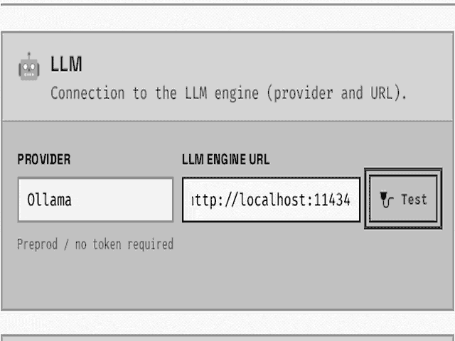

<strong>Test Ollama connection</strong><br>
<em>Default / loopback / LAN URL → Test OK (model count varies) · token entered → Test fails. Focus on the Test control.</em>

</td>
</tr>
</table>

---


<a id="feat-5-7-7"></a>

### ⚠ 5.7.7. Danger zone Wipe all

**Wipe all** is not a soft reset. Confirm once, and PromptDeMerde **destroys** what this origin had saved for the product — on purpose.

Gone after confirmation:

- **Profiles**, active profile choice, workspace text, LLM / STT / proxy settings, UI preferences (theme, language, layout, and the rest of the personalization stack)
- **Provider tokens** and other `pdm_*` keys in **localStorage** and **sessionStorage**
- **Audio IndexedDB** (recorded takes / blobs) and known STT databases (including Parakeet cache when present)
- **Cache Storage** entries prefixed for PromptDeMerde, plus in-memory STT / market / export caches invalidated before reload

The app then reloads as a **fresh install** (`pdm_fresh` boot flag, cleared after start). Export a profile ZIP **before** this button if anything must survive.

**Caveat — not the same as Ctrl+F5.** Wipe all clears **PromptDeMerde data for this site origin**. It does **not** empty the whole browser (every other site’s cookies, history, or global Chromium/Firefox “clear browsing data”), and it is **not** a hard refresh (Ctrl+F5 / Shift+F5) that only busts page cache. For a blank-browser test outside this origin, use the browser’s own wipe tools.

[Technical documentation](docs/Documentation.md#feat-5-7-7)

---


<a id="feat-5-7-8"></a>

### 📎 5.7.8. Footer: project carousel and resources

The footer carries navigation, resource links, stack badges (LLM, Ollama, STT, JSON, OSS, and related labels), and documentation / support entry points. On the **official site**, the right-hand column also shows a DreamProjectAI **projects carousel** — the promotional strip for sibling projects.

**Clone roadmap.** That DreamProjectAI carousel stays on the official site for now. Future **clone / self-host** builds from this repository will **no longer ship** the advertising strip — badges and resource links remain; the DreamProjectAI project carousel will not.

<p align="center">
  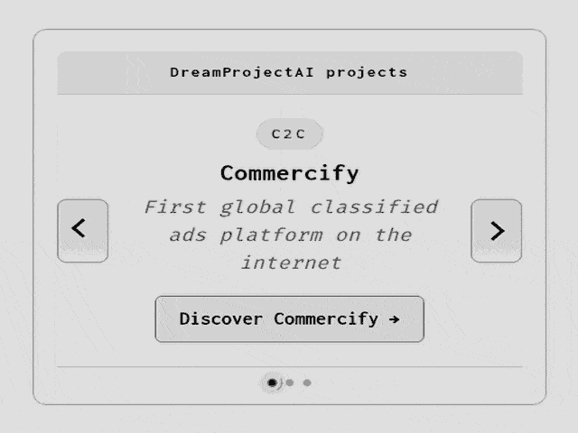
  &nbsp;
  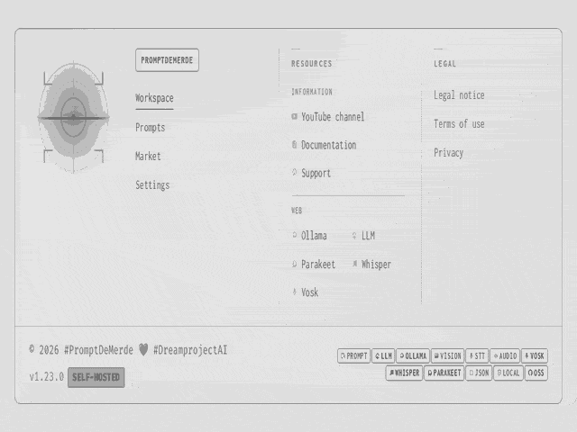
  <br>
  <strong>Left:</strong> official footer — DreamProjectAI ad carousel · <strong>Right:</strong> footer without that strip (clone roadmap)
  <br>
  <em>Random camera zooms on each layout; no dependency on clicking the carousel.</em>
</p>

[Technical documentation](docs/Documentation.md#feat-5-7-8)

---


<a id="menu-json-profile"></a>

## 🧳 6. JSON profile

<table>
<tr>
<td width="68%" valign="top">

A **JSON profile** is the portable pack for PromptDeMerde. Under **Options → JSON profile**, the active pack can be switched, a personal profile created from the current session, a `.zip` imported, or the session exported as a ZIP archive. That archive can carry the system prompt, `#Tag` context prompts, LLM settings, theme, language, Workspace session state, history (when the maximal preset includes it), and UI labels — the same portable unit described in **5.5.1** / **5.5.4**.

Export before wiping site data (**5.7.7**) or moving to another machine: *Options → JSON profile → Export*. To restore elsewhere, use *Options → JSON profile → Import* with a `.zip` only — a lone `.json` / raw JSON file is **never** accepted. Proxy and Ollama tokens stay out of portable archives.

[Technical documentation](docs/Documentation.md#menu-json-profile)

</td>
<td width="32%" valign="top" align="center">

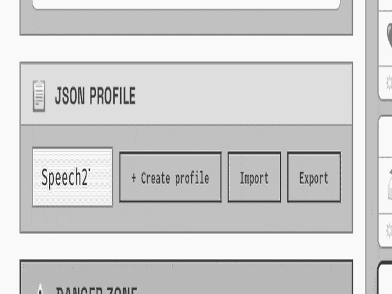

<strong>JSON profile — Import and Export</strong><br>
<em>Options → JSON profile: camera zooms Import, then Export (no click).</em>

</td>
</tr>
</table>

---


<a id="menu-prerequisites"></a>

## 📋 7. Prerequisites

**Reformulate** always needs a running **Ollama** process that the browser can reach (usually on the same PC as the browser). Voice dictation and file transcription also need the in-browser STT engines (Vosk, Whisper, Parakeet). Where those engines come from depends on the path:

| Path | Application UI | Ollama | Voice-dictation / STT binaries |
| ---- | -------------- | ------ | ------------------------------ |
| **Official site** | Served by <a href="https://promptdemerde.com/" target="_blank" rel="noopener noreferrer">promptdemerde.com</a> | On **your** machine (direct call from the browser) | Served by the official site — **no** local restore script |
| **Self-host / clone** | Your PHP vhost after a GitHub clone | On your machine or LAN | **Must** run `install/restore-large-assets.sh` after clone |

Install Ollama from <a href="https://ollama.com/download" target="_blank" rel="noopener noreferrer">ollama.com/download</a> (Linux, macOS, or Windows). Then pull at least one chat model, for example:

```bash
ollama pull llama3.2
```

For image description, pull a vision model as well (default in the app: `moondream`).

[Technical documentation](docs/Documentation.md#menu-prerequisites)

---


<a id="prereq-7-1"></a>

### 🌍 7.1. Official site

For <a href="https://promptdemerde.com/" target="_blank" rel="noopener noreferrer">promptdemerde.com</a>, the HTML / JS / CSS and STT assets are loaded from the official server. **Inference does not run on that server** for the normal visitor path: the browser talks **directly** to **your** Ollama at `http://localhost:11434` (or a private LAN URL — **5.7.6**). Keep **“I don’t have a token”** checked under *Options → LLM*.

**1 — Install and pull.** Install Ollama on the **same computer** as the browser, then `ollama pull …` as above. Use a desktop Chromium or Firefox build for STT / WebAudio; allow the microphone when using voice dictation.

**2 — Allow the site origin (required).** From `https://promptdemerde.com`, the browser sends a cross-origin request to local Ollama. Ollama must advertise CORS for that origin via **`OLLAMA_ORIGINS`**. Without it, **Test** fails with `Failed to fetch` even when Ollama is running.

There are **two usual ways to launch Ollama** with that variable set:

**A — One-shot in a terminal** (good for a quick check; stops when the terminal closes):

```bash
OLLAMA_ORIGINS=https://promptdemerde.com ollama serve
```

**B — Persistent service** (recommended day to day), then restart Ollama so the env is picked up:

- **Linux (systemd):** drop-in under `/etc/systemd/system/ollama.service.d/` with `Environment="OLLAMA_ORIGINS=https://promptdemerde.com"`, then `daemon-reload` and `systemctl restart ollama`.
- **macOS:** `launchctl setenv OLLAMA_ORIGINS "https://promptdemerde.com"`, quit the Ollama menu-bar app completely, and start it again.
- **Windows:** set the user environment variable `OLLAMA_ORIGINS=https://promptdemerde.com`, then restart Ollama from the tray.

**3 — Verify and open the site.**

```bash
curl -i http://localhost:11434/api/tags
```

Open <a href="https://promptdemerde.com/" target="_blank" rel="noopener noreferrer">promptdemerde.com</a> → *Options → LLM* → URL `http://localhost:11434` → **Test**. The status should report models found (**5.7.6**). If Ollama runs on another LAN machine, set the URL to that host (for example `http://ollama.local:11434`) and configure **`OLLAMA_ORIGINS` on the machine that runs Ollama**, not only on the browser PC.

[Technical documentation](docs/Documentation.md#prereq-7-1) · [`SECURITY.md`](SECURITY.md)

---


<a id="prereq-7-2"></a>

### 🛠 7.2. Self-host

A private install (**GitHub clone**) uses the **same application code** as the official site, with the same client-side privacy model (**3** / **4**). After clone, three layers are required: PHP to serve the SPA, **reassembled voice-dictation / STT binaries**, and a reachable Ollama.

**1 — Host stack.** PHP-capable Apache or Nginx + PHP, plus Git. Deploy the repository root on the vhost.

**2 — Restore voice-dictation engines (mandatory after clone).** Large STT files (Vosk Mini / Maxi archives, Whisper ONNX, Parakeet ONNX, and related binaries under `assets/stt/`) are **not** shipped as complete blobs on GitHub. They are stored as split `*.partNNN` pieces. Run:

```bash
cd install
bash restore-large-assets.sh
```

That script **concatenates** the parts, checks SHA-256 fingerprints, and writes the full engine files in place (it is not an optional “nice to have”). Without it, voice dictation and Whisper file transcription fail or stay incomplete. The official site already serves those restored assets — clones must rebuild them locally.

**3 — Ollama on the clone.** Install Ollama and pull a model the same way as in **7.1**. Point *Options → LLM* at `http://localhost:11434` or a LAN URL, then use **Test**. When the app and Ollama share the same machine via a local URL, CORS is usually simpler than on the official HTTPS site; if the browser origin is not localhost (or Ollama is on another host), set `OLLAMA_ORIGINS` to **that site origin** and use the same **two launch methods** as in **7.1** (one-shot `ollama serve` vs persistent service).

**4 — Optional operator knobs.** `PDM_ENV` only labels the footer badge. A proxy token is needed only when the server relay is locked (`PDM_PROXY_TOKEN` — **5.7.3** / **5.7.6**). Day-to-day self-hosters keep **“I don’t have a token”** checked.

Reformulation quality depends on the chosen Ollama model. STT runs as ONNX / WASM in the browser; a dedicated GPU helps Whisper / Parakeet but is optional for Vosk.

[Technical documentation](docs/Documentation.md#prereq-7-2) · [`SECURITY.md`](SECURITY.md)

---


<a id="menu-try-it"></a>

## ▶ 8. Try it in three steps

Three steps are enough to reformulate a raw prompt on the official site (or on a clone once prerequisites in **7** are met). Install and launch Ollama as in **7.1** (including `OLLAMA_ORIGINS` on the official site). Keep **“I don’t have a token”** checked under *Options → LLM* unless an operator relay is intentionally locked.


| Step  | Action |
| ----- | ------ |
| **1** | Install <a href="https://ollama.com/download" target="_blank" rel="noopener noreferrer">Ollama</a> on the same PC as the browser; pull a model |
| **2** | Open <a href="https://promptdemerde.com/" target="_blank" rel="noopener noreferrer">promptdemerde.com</a> — keep **“I don’t have a token”** checked (*Options → LLM*) |
| **3** | Import a JSON profile (*Options → JSON profile*) or configure *Prompts* — then write or dictate → **Reformulate** → copy |

**<a href="https://promptdemerde.com/" target="_blank" rel="noopener noreferrer">Open PromptDeMerde →</a>**

[Technical documentation](docs/Documentation.md#menu-try-it)

---


<a id="menu-self-hosting"></a>

## 🖥 9. Self-hosting (optional)

Self-hosting is optional: the official site already runs the same application. A private install clones the repository, reassembles large voice-dictation files from local parts (no download), serves the SPA with PHP, and points the browser at local Ollama.

```bash
git clone https://github.com/JeanSebastienBash/promptdemerde.git
cd promptdemerde/install
bash restore-large-assets.sh
```

After clone, `restore-large-assets.sh` **reassembles** the large voice-dictation model files from the `*.partNNN` pieces already in the repository. Run the site with Apache or Nginx + PHP, install Ollama, then open the local URL.

**Operators.** Visitors and self-hosters keep **“I don’t have a token”** checked. A proxy token is for an official production operator relay only. Optional `PDM_ENV` drives the footer badge PROD / PRE-PROD / SELF-HOSTED (**5.7.3**).

[Technical documentation](docs/Documentation.md#menu-self-hosting) · [`SECURITY.md`](SECURITY.md)

---


<a id="menu-credits"></a>

## © 10. Credits

Published by **<a href="https://dreamproject.online" target="_blank" rel="noopener noreferrer">DreamProjectAI</a>**.

Third-party components (full list: [`THIRD_PARTY_NOTICES.md`](THIRD_PARTY_NOTICES.md)):

- **<a href="https://ollama.com" target="_blank" rel="noopener noreferrer">Ollama</a>** — local LLM runtime for Reformulate and vision (not redistributed in this repo)
- **JSZip** — profile ZIP in the browser
- **ONNX Runtime Web**, **Transformers.js**, **Vosk**, **Parakeet** — in-browser speech pipelines
- **Fonts** shipped locally (Fira Code, Inconsolata, Space Grotesk, Archivo Black, Anton) — OFL

Security reports: see [`SECURITY.md`](SECURITY.md).

---


<a id="menu-further-reading"></a>

## 📚 11. Further reading

Cross-links for screens, deployment, security, and zone docs — the same Technical documentation foot pattern used through Features.


| Topic | Document |
| ----- | -------- |
| Screens, keys, ZIP, STT, architecture | **[Technical documentation](docs/Documentation.md)** |
| Contribute | [`CONTRIBUTING.md`](CONTRIBUTING.md) |
| Security and deployment | [`SECURITY.md`](SECURITY.md) |
| Third-party notices | [`THIRD_PARTY_NOTICES.md`](THIRD_PARTY_NOTICES.md) |
| STT models (zone) | [`docs/Stt.md`](docs/Stt.md) |
| Vosk catalogue | [`docs/Stt-vosk.md`](docs/Stt-vosk.md) |
| Profiles (zone) | [`docs/Profiles.md`](docs/Profiles.md) |
| Vendor JS (zone) | [`docs/Vendor.md`](docs/Vendor.md) |

---


<a id="menu-license"></a>

## ⚖ 12. License

MIT — <a href="https://dreamproject.online" target="_blank" rel="noopener noreferrer">DreamProjectAI</a>

