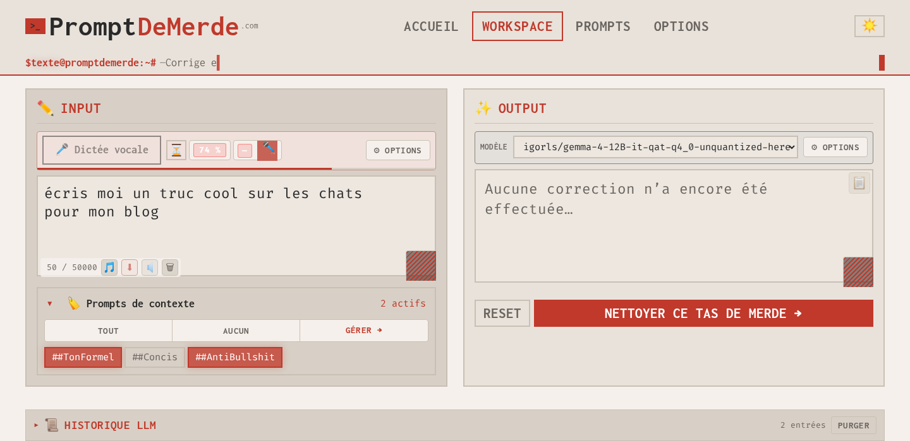
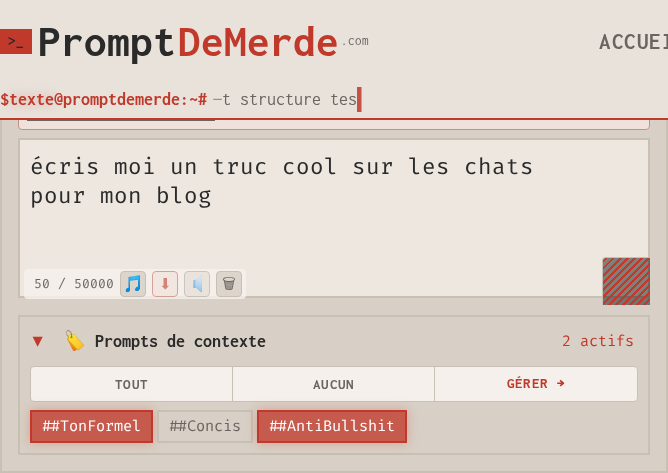
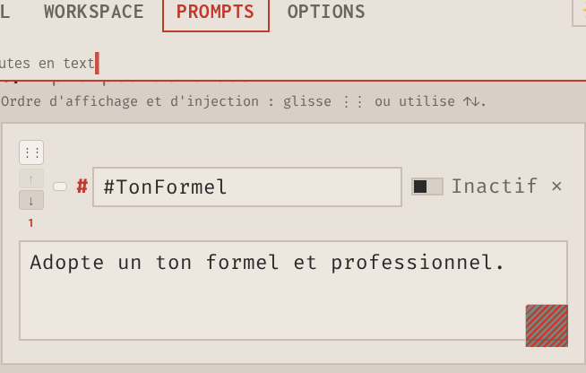
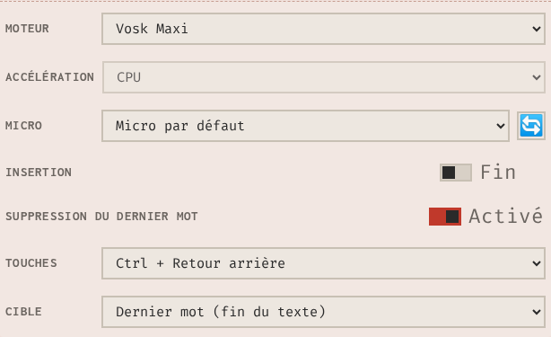

# PromptDeMerde

<p align="center">
  <a href="README.md"></a>
  &nbsp;
  <a href="README.fr.md"></a>
</p>

<p align="center">
  <a href="LICENSE"></a>
  <a href="https://github.com/JeanSebastienBash/promptdemerde/tags"></a>
  <a href="https://github.com/JeanSebastienBash/promptdemerde/actions/workflows/ci.yml"></a>
</p>

<p align="center">
  <strong>Browser application that rephrases a draft into a clear prompt via a local Ollama model.</strong>
</p>

<p align="justify">
<strong>PromptDeMerde</strong> is a browser SPA: you write or dictate a draft; the app rephrases it into a structured instruction via <a href="https://ollama.com">Ollama</a> on your machine.
The result appears in the Output panel and can be copied into ChatGPT, Claude, Midjourney, another Ollama model, or the tool of your choice.
The site <a href="https://promptdemerde.com/">promptdemerde.com</a> serves the same codebase as a self-hosted clone of this repository.
Free · open source (<a href="LICENSE">MIT</a>) · no account.
</p>

<p align="center">
  <a href="https://promptdemerde.com/">Official site</a> ·
  <a href="docs/DOCUMENTATION-TECHNIQUE.en.md">Advanced documentation</a> ·
  <a href="SECURITY.md">Security</a> ·
  <a href="CONTRIBUTING.md">Contributing</a> ·
  <a href="README.fr.md">Français</a>
</p>

---

## 🎬 Watch (coming soon)

<p align="center">
  
</p>

<!-- Landscape demo video — URL to be added later (YouTube / hosted MP4). -->

> **Landscape demo video — slot reserved (16:9).**

---

<a id="menu-whats-new"></a>

## 🆕 What’s new

### Version 1.23.0 (RC)

*Release candidate — not yet stable.*

* **Image import → description** in the Workspace: file picker only (PNG, JPEG, WebP, GIF) → local Ollama vision model (default `moondream`) → text in Input.
* Vision model and instruction editable under **Prompts** (`pdm_image_model`, `pdm_image_prompt`).
* Profile contract: **51** `pdm_*` keys; shipped `speech2texte` profile aligned to v1.23.0.
* Public GitHub: **git tags only** — no GitHub Releases; no declared stable line yet.

[Advanced docs — image import](docs/DOCUMENTATION-TECHNIQUE.en.md#6bis-import-image--description) · [Tag notes](.github/RELEASE_v1.23.0.md)

### Version 1.22.x

* Audio **or video** import for local transcription; dictation available again after Whisper without Reset.
* Token **compression**: optional checkboxes applied on **Clean** (no separate Compress button).
* History cards show Original / Compressed traces for Input, the system prompt, context prompts, and Output.
* Context prompt generators by **intention**: model picker, stream, Stop.
* On a clone without a local catalogue, **Marketplace** opens [promptdemerde.com/#market](https://promptdemerde.com/#market).
* Product toasts / status: impersonal register (twelve locales).

[Tag notes v1.22.0](.github/RELEASE_v1.22.0.md)

---

## Menu

* [What’s new](#menu-whats-new)
* [What PromptDeMerde is](#menu-what-is)
* [Who it is for](#menu-who)
* [Official site = self-hosted copy](#menu-official-site)
* [Zero telemetry](#menu-zero-telemetry)
* [Features](#menu-features)
  * [1–18 — core capabilities](#1-clean-rephrase-with-ollama)
  * [19–40 — shell, UX, Options, Market, footer](#19-hash-based-spa-navigation)
* [JSON profile](#menu-json-profile)
* [Prerequisites](#menu-prerequisites)
* [Try it in three steps](#menu-try-it)
* [Self-hosting](#menu-self-hosting)
* [Credits](#menu-credits)
* [License](#menu-license)

---

<a id="menu-what-is"></a>

## ✨ What PromptDeMerde is

PromptDeMerde reformulates a **draft** (typed, dictated, transcribed from audio/video, or described from an image) into a **prompt** using:

* an optional **system prompt**;
* optional **context prompts (`#Tag`)** enabled in the Workspace;
* a model served by **Ollama** on the user’s machine.

Session data (draft, history, settings, profiles) is stored in the **browser** (`localStorage`; IndexedDB for dictation audio). No signup required. User drafts stay outside any server-side application database.

[Advanced documentation — presentation](docs/DOCUMENTATION-TECHNIQUE.en.md#1-présentation) · [Privacy model](docs/DOCUMENTATION-TECHNIQUE.en.md#2-modèle-de-confidentialité)

---

<a id="menu-who"></a>

## 👥 Who it is for

* **Solo / freelancer** — one JSON profile reused for recurring prompt work (mail, posts, briefs, image prompts, etc.).
* **Power user** — local Ollama, editable system prompt and context prompts, in-browser STT, vision model, compression, multipass Input.
* **Small team** — same JSON profile ZIP shared so everyone uses the same cleaning rules (shared file configuration).
* **Anyone using the official site or a private install** — same application code and the same client-side data model (see privacy below).

---

<a id="menu-official-site"></a>

## 🏠 Official site = self-hosted copy

[promptdemerde.com](https://promptdemerde.com/) and a clone from this repository run the **same application** (same SPA, Workspace, profile ZIP format).

While the official site is online, DreamProjectAI allows using it under the same conditions as a private install for application behaviour. Self-hosting: clone, run `install/restore-large-assets.sh`, serve with Apache or Nginx + PHP, point the browser at your URL.

In both cases, Workspace content and profiles stay in the browser.

---

<a id="menu-zero-telemetry"></a>

## 🛡️ Zero telemetry

> Prompts, history, imported media, transcriptions, and profile data are processed and stored in the **browser**. The application collects **no product telemetry**. There is **no** application database of user content on the official server.

Web-server access logs may record **IP address** and **page URL** (standard HTTP logging). Those logs do not contain Workspace text, uploaded files, or transcription results.

Same client-side model on the official site and on a self-hosted copy.  
[`SECURITY.md`](SECURITY.md) · [Advanced docs — privacy](docs/DOCUMENTATION-TECHNIQUE.en.md#2-modèle-de-confidentialité)

---

<a id="menu-features"></a>

## 🚀 Features

Each subsection describes a delivered capability and links to the matching section in the advanced documentation. Screenshots: `assets/images/screenshots/`.

---

### 1. Clean / rephrase with Ollama

**Clean** sends Input to a local Ollama model with the active system prompt and the enabled context prompts (`#Tag`). Output is the rephrased prompt, ready to copy.

The model is the one configured in the app (pulled with `ollama pull`). Connection errors surface in the UI with a path back to Options → LLM.

[Advanced docs — Workspace](docs/DOCUMENTATION-TECHNIQUE.en.md#32-workspace) · [Ollama flows](docs/DOCUMENTATION-TECHNIQUE.en.md#4-ollama--flux-a-et-flux-b)

---

### 2. Workspace Input → Output

Workspace layout:

* **Input** — draft (type, dictate, import media, image description)
* **Output** — cleaned prompt
* Actions — Clean, copy, Reset (confirmation required)

<p align="center">
  
</p>


[Advanced docs — Workspace](docs/DOCUMENTATION-TECHNIQUE.en.md#32-workspace)

---

### 3. System prompt and context prompts (#Tag)

The **system prompt** sets the cleaning personality. It can be enabled or disabled. When empty, the built-in default is used.

**Context prompts (`#Tag`)** are stackable blocks. Enable or disable them for each Clean. Injection order — **before** or **after** the system prompt — is configurable.

[Advanced docs — prompts, system, context prompts](docs/DOCUMENTATION-TECHNIQUE.en.md#5-prompts--système-prompts-de-contexte-générateurs)

---

### 4. AI-assisted context prompt generators

On the **Prompts** screen, the context prompt generators create a new `#Tag` from an **intention** or a **title** via the local Ollama model. Streaming, Stop, model selection and basic options are available on that screen.

[Advanced docs — assisted `#Tag` generation](docs/DOCUMENTATION-TECHNIQUE.en.md#52-génération-assistée-de-tag)

<p align="center">
  
</p>

---

### 5. Unlimited voice dictation with Vosk, Parakeet or Whisper

The Workspace dictation strip supports unlimited voice dictation. Available engines are **Vosk**, **Parakeet** and **Whisper**, depending on which one you load. Recognition runs in the browser: microphone audio stays on the device.

Dictation continues when you open Options or documentation. Stopping uses an explicit control.

<p align="center">
  
</p>

[Advanced docs — dictation and audio](docs/DOCUMENTATION-TECHNIQUE.en.md#6-dictée-vocale-et-audio)

---

### 6. Import audio or video (audio transcription)

The 🎵 import accepts audio files and, when the browser can decode them, video containers. Audio transcription uses the local Whisper Maxi path; the resulting text is written into Input. Afterwards, dictation remains available without a full Reset.

Media is processed on the machine that opened the page.

[Advanced docs — dictation and audio](docs/DOCUMENTATION-TECHNIQUE.en.md#6-dictée-vocale-et-audio)

---

### 7. Export one session audio file

Download a single audio file that merges the dictation takes of the current session. Merge and download run in the browser.

[Advanced docs — WebM recording](docs/DOCUMENTATION-TECHNIQUE.en.md#64-enregistrement-webm)

---

### 8. Describe an image (Ollama vision)

Workspace file picker → vision-capable Ollama model → description text in Input. Model and instruction are set under Prompts. Missing model: toast with `ollama pull <model>` and a pointer to Prompts → image.

[Advanced docs — image → description](docs/DOCUMENTATION-TECHNIQUE.en.md#6bis-import-image--description)

---

### 9. Local history with traces

Capped local history of Clean runs. Cards expose Input, the system prompt, context prompts, and Output; with compression enabled, Original and Compressed pairs. Copy, restore, purge. Included in a full profile export when that preset is selected.

<p align="center">
  
</p>

[Advanced docs — Workspace](docs/DOCUMENTATION-TECHNIQUE.en.md#32-workspace)

---

### 10. Optional token compression

Checkboxes cover the system prompt, context prompts, Input, and Output. Applied when **Clean** runs. Default: all off.

[Advanced docs — compress tokens](docs/DOCUMENTATION-TECHNIQUE.en.md#323-compresser-les-tokens)

---

### 11. Long Input, multi-pass

Long Input is split into successive Ollama passes; results are concatenated. Limits and behaviour: advanced docs.

[Advanced docs — long INPUT multipass](docs/DOCUMENTATION-TECHNIQUE.en.md#321-input-long-multi-pass-inférence)

---

### 12. Workspace LLM options

Workspace panel: model, temperature, max tokens, timeout, thinking when supported. URL and connection test: Options → LLM. Public path: leave **“I don’t have a token”** checked and use local Ollama.

[Advanced docs — LLM parameters](docs/DOCUMENTATION-TECHNIQUE.en.md#43-paramètres-llm-workspace-panel)

---

### 13. Output display formats

Output can be shown as plain text, JSON, or HTML.

[Advanced docs — OUTPUT display format](docs/DOCUMENTATION-TECHNIQUE.en.md#322-format-daffichage-output)

---

### 14. Import / export JSON profile (ZIP)

Portable unit: **ZIP** archive with the JSON profile (and related assets when included). Import accepts **`.zip` only**. Client-side processing; integrity check on import. Proxy tokens are excluded from the portable profile.

<p align="center">
  
</p>

[Advanced docs — ZIP export / import](docs/DOCUMENTATION-TECHNIQUE.en.md#7-export--import--archive-zip-profil)

---

### 15. UI personalization

Profile can include logo colours, screen titles, button labels, theme, header animation / synopsis. Documented under ZIP customization keys.

[Advanced docs — UI keys and brand](docs/DOCUMENTATION-TECHNIQUE.en.md#75-personnalisation-par-édition-zip)

---

### 16. Twelve UI languages & about 50 themes

Twelve UI locales. Themes: light/dark families. First-visit default: **Marron clair** (`marron-day`). Language and theme can be included in a profile export.

[Advanced docs — i18n](docs/DOCUMENTATION-TECHNIQUE.en.md#35-i18n)

---

### 17. Same code everywhere

Official site and self-hosted install share the application codebase. Operator proxy token: official production relay only. Visitors using local Ollama keep **“I don’t have a token”** checked.

[Advanced docs — installation](docs/DOCUMENTATION-TECHNIQUE.en.md#10-installation-auto-hébergée) · [`SECURITY.md`](SECURITY.md)

---

### 18. Marketplace of JSON profiles

A marketplace of ready-to-import JSON profiles is available on the [official site](https://promptdemerde.com/#market) (soon).

On a public clone without a local catalogue, the Marketplace menu opens that URL.

---

### 19. Hash-based SPA navigation

The UI switches between Workspace, Prompts, Options, Marketplace and stub pages (legal notice, terms, privacy, support) via the URL hash, without a full page reload. The footer Documentation link opens the GitHub technical docs (FR or EN according to the UI language).

---

### 20. Burger menu, Escape and loader

On small viewports, the burger menu opens and closes navigation. Escape closes the menu. A full-screen loader shows during startup initialisation.

---

### 21. Environment badge and GitHub version

The footer shows an environment badge (PROD, PRE-PROD or SELF-HOSTED) from `PDM_ENV`. The version label links to the project’s GitHub repository (versioning is via **git tags** only — no GitHub Releases).

---

### 22. Ctrl/Cmd+Enter, toasts and Copied feedback

**Ctrl+Enter** (or **Cmd+Enter** on macOS) runs **Clean**. Toast notifications stay visible for about 4.5 seconds. Copy buttons show a short “Copied” confirmation.

---

### 23. Reduced motion and RTL

The app respects `prefers-reduced-motion` to limit animations. Right-to-left locales (for example Arabic) set `lang` and `dir` on the document.

---

### 24. Logo, shell animation and profile synopsis

The navigation logo, header shell animation and typewriter synopsis can be driven by the profile (brand, colours, text).

---

### 25. Day / night theme toggle

A navigation control switches quickly between light and dark variants of the active theme family.

---

### 26. Input counter, confirmed Reset and trash

Input shows a character counter (export ceiling 50,000). **Reset** asks for confirmation and clears Input and Output. A trash control clears Input only. These actions stay blocked during dictation or an active inference.

---

### 27. Draft autosave and prompt guard

The Workspace draft (Input, Output, thinking, context-panel state) autosaves in the browser. **Clean** stays disabled until a system prompt or at least one context prompt is active; a guard message explains what to enable.

---

### 28. Advanced dictation options

The dictation strip includes an options panel: engine preload, Vosk language, CPU or GPU acceleration, microphone choice, insert at end or at caret, and a delete-word shortcut. A progress bar tracks model load. Hints cover HTTPS / LAN constraints.

---

### 29. Dictation outside Workspace and resume after interrupt

Dictation can continue while opening Options or documentation. Before a disruptive reload (language change, wipe, profile import), a modal asks for confirmation; a beep and a resume offer are available after reload.

---

### 30. Mutual exclusion of Input modes

Dictation, audio/video import, image import and inference lock each other out. Inline status and toasts state the cause and the next action when modes conflict.

---

### 31. Compression panel, overlay and Stop

Token compression is configured in a collapsible panel. While Output compression runs, an overlay locks the area and offers **Stop**. Chips mark targets already compressed in the session.

---

### 32. Workspace context-prompt panel

The context-prompt panel starts collapsed; open/closed state is remembered. A badge shows how many tags are active. **All** / **None** bulk-select tags. A **Manage** link opens the Prompts screen.

---

### 33. Thinking, Stop and stream metadata

When the model supports it, thinking can be enabled with a character cap (0 = unlimited). A dedicated panel shows and copies thinking text. **Stop** cancels inference or compression. During the stream, the UI shows time, tokens, throughput and multi-pass index.

---

### 34. History: restore, modal and JSON export

Local history (about 100 entries) can restore Input, Output and thinking. Entries open in a modal, support per-block copy, JSON export and optional source audio from IndexedDB. Global purge and single-entry delete ask for confirmation.

---

### 35. Prompts screen: order, drag-and-drop and counter

On the Prompts screen, the system prompt toggles with autosave. Context-prompt injection order (before or after system) includes a diagram. The tag list reorders by drag-and-drop or arrows. A counter shows how many context prompts exist.

---

### 36. LLM Options: Test, token and themes

Under Options → LLM, **Test** checks the Ollama URL and refreshes the model list. A proxy token, when used, stays in browser session storage. The theme picker offers twenty-five families in light and dark.

---

### 37. Profiles: create, switch, export modal

Options → JSON profile can create a profile, switch (with confirm and reload), import a ZIP and export through a modal (file name, minimal or maximal preset, startup language, i18n flags).

---

### 38. Danger zone Wipe all

**Wipe all** asks for confirmation, then clears localStorage, sessionStorage, audio IndexedDB and STT caches, and reloads into a fresh-install state.

---

### 39. Marketplace: search, filters and detail card

When a local catalogue is present, Marketplace provides search, filters (price, domains, languages, publishers), sort, grid or list views and a detail modal with download. On a clone without a catalogue, the menu opens the official site.

---

### 40. Footer: project carousel and resources

The footer includes a DreamProjectAI project carousel, stack badges (LLM, Ollama, STT, JSON, OSS, and related labels) and links to documentation, support and external resources.

---

<a id="menu-json-profile"></a>

## 💾 JSON profile

<p align="center">
  
</p>

The JSON profile (exported as ZIP) can hold the system prompt, context prompts (`#Tag`), LLM settings, theme, language, Workspace draft, history, and UI labels.

**Before clearing site data or changing machine:** export the profile (*Options → JSON profile → Export*). Import: *Options → JSON profile → Import* (`.zip` only).

[Advanced docs — ZIP](docs/DOCUMENTATION-TECHNIQUE.en.md#7-export--import--archive-zip-profil)

---

<a id="menu-prerequisites"></a>

## 📦 Prerequisites

<p align="center">
  
</p>

### Official site

* Desktop browser (Chromium or Firefox recommended for STT / WebAudio)
* [Ollama](https://ollama.com/download) on the **same computer** as the browser
* At least one chat model (example: `ollama pull llama3.2`)
* For image description: a vision model (default in app: `moondream`)
* Microphone permission for dictation
* Network to load the site; usual visitor setup talks to Ollama on `localhost`

For **https://promptdemerde.com**:

```bash
OLLAMA_ORIGINS=https://promptdemerde.com ollama serve
```

[Advanced docs — Ollama](docs/DOCUMENTATION-TECHNIQUE.en.md#4-ollama--flux-a-et-flux-b)

### Self-host

* PHP-capable host (Apache or Nginx + PHP)
* Git
* Disk for STT model parts; after clone:

```bash
cd install
bash restore-large-assets.sh
```

* Ollama reachable from the browser
* Optional: `PDM_ENV` (footer badge); proxy token for official relay operators only — [`SECURITY.md`](SECURITY.md)

Clean quality depends on the chosen Ollama model. STT uses ONNX / WASM in the browser; a dedicated GPU is optional.

[Advanced docs — self-hosted install](docs/DOCUMENTATION-TECHNIQUE.en.md#10-installation-auto-hébergée)

---

<a id="menu-try-it"></a>

## ▶️ Try it in three steps

| Step | Action |
|------|--------|
| **1** | Install [Ollama](https://ollama.com/download) on the same PC as the browser; pull a model |
| **2** | Open [promptdemerde.com](https://promptdemerde.com/) — keep **“I don’t have a token”** checked (*Options → LLM*) |
| **3** | Import a JSON profile (*Options → JSON profile*) or configure *Prompts* — then write or dictate → **Clean** → copy |

<p align="center">
  <a href="https://promptdemerde.com/"><strong>Open PromptDeMerde →</strong></a>
</p>

---

<a id="menu-self-hosting"></a>

## 🖥️ Self-hosting (optional)

```bash
git clone https://github.com/JeanSebastienBash/promptdemerde.git
cd promptdemerde/install
bash restore-large-assets.sh
```

Serve the folder with Apache or Nginx + PHP; install Ollama; open your URL. `restore-large-assets.sh` is required after clone.

<details>
<summary><strong>Operators — token proxy and PDM_ENV</strong></summary>

<br>

Visitors and self-hosters: keep **“I don’t have a token”** checked. Proxy token: official production operator relay only. Optional `PDM_ENV`: footer badge PROD / PRE-PROD / SELF-HOSTED.

[`SECURITY.md`](SECURITY.md) · [Deployment notes](docs/DOCUMENTATION-TECHNIQUE.en.md#deploy-pdm-env-badges)

</details>

---

<a id="menu-credits"></a>

## 🙏 Credits

Published by **[DreamProjectAI](https://dreamproject.online)**.

Third-party components (full list: [`THIRD_PARTY_NOTICES.md`](THIRD_PARTY_NOTICES.md)):

* **[Ollama](https://ollama.com)** — local LLM runtime for Clean and vision (not redistributed in this repo)
* **JSZip** — profile ZIP in the browser
* **ONNX Runtime Web**, **Transformers.js**, **Vosk**, **Parakeet** — in-browser speech pipelines
* **Fonts** shipped locally (Fira Code, Inconsolata, Space Grotesk, Archivo Black, Anton) — OFL

Security reports: see [`SECURITY.md`](SECURITY.md).

---

## 📚 Further reading

| Topic | Document |
|-------|----------|
| Screens, keys, ZIP, STT, architecture | [**Advanced user documentation**](docs/DOCUMENTATION-TECHNIQUE.en.md) |
| Contribute | [`CONTRIBUTING.md`](CONTRIBUTING.md) |
| Security and deployment | [`SECURITY.md`](SECURITY.md) |
| Third-party notices | [`THIRD_PARTY_NOTICES.md`](THIRD_PARTY_NOTICES.md) |
| Français | [`README.fr.md`](README.fr.md) |

---

<a id="menu-license"></a>

## License

MIT — [DreamProjectAI](https://dreamproject.online)
